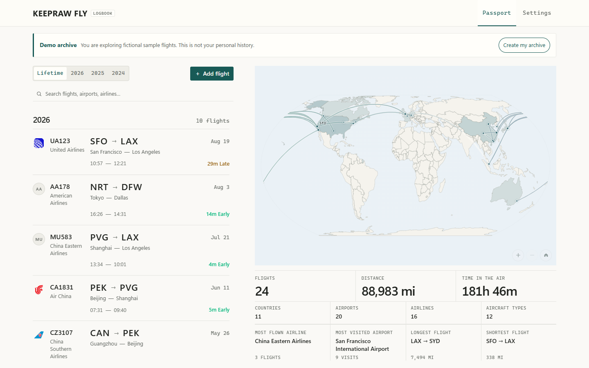
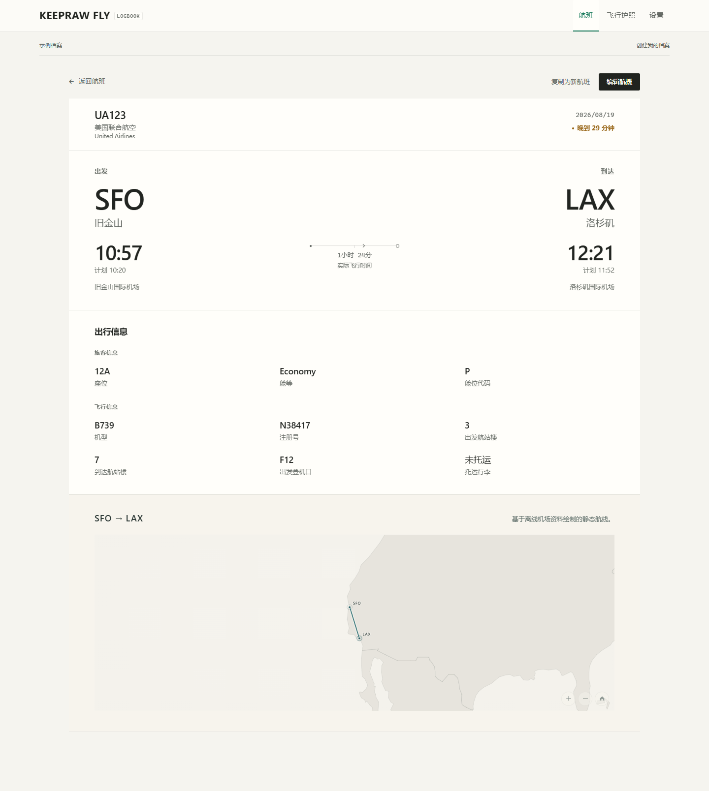
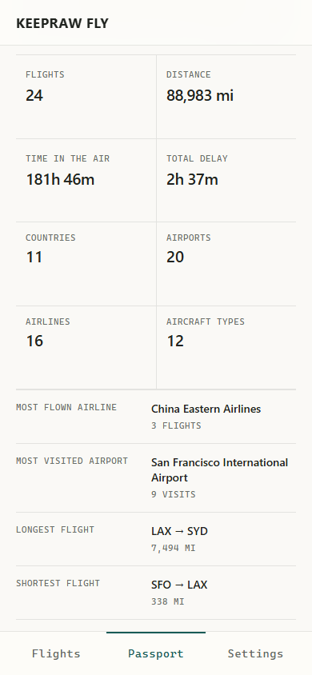
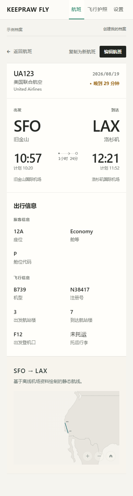

# Keepraw Fly

**开源、本地优先的个人航班档案与飞行护照。**

[在线使用 Keepraw Fly](https://fly.keepraw.com) · [English](README.md)

> 数据比应用更长久。



## 主要功能

- **飞行护照：** 浏览全部或指定年份的航班、距离、空中时间、延误、机场、航司、机型与航线亮点。
- **航班档案与详情：** 搜索、筛选、新增、编辑、复制航班，并查看完整记录。
- **航线可视化：** 在桌面端飞行护照和航班详情地图中浏览已记录航线。
- **可迁移数据：** 导出及迁移经过验证的 Keepraw Fly JSON 档案；写入前预览 JSON、Keepraw Fly CSV 和 Flighty CSV。
- **常旅客资料：** 将常旅客计划关联至多个航司及航班记录。
- **本地优先：** 航班历史保存在浏览器中；无需账号，也没有保存航班历史的云端后端。
- **跨设备设计：** 适配桌面与移动端，支持英文、简体中文和繁體中文。

## 截图

| 飞行护照 | 航班详情 |
| --- | --- |
|  |  |

<p align="center">
  
  &nbsp;&nbsp;
  
</p>

| 桌面端设置 | 移动端设置 |
| --- | --- |
|  |  |

## 本地数据与隐私

### 本地数据与备份

航班记录默认保存在当前浏览器的 IndexedDB 中。Keepraw Fly 没有账号系统，也没有保存用户航班历史的云端后端。默认静态构建不会上传航班记录，也不包含分析 SDK。

浏览器支持并授予权限时，Keepraw Fly 可以申请持久存储，以降低浏览器在存储空间紧张时自动清理本地数据的概率。该保护无法防止用户主动清除网站数据，也不能替代备份。

建议定期导出 Keepraw Fly JSON 档案，并在更换浏览器、设备或清除网站数据前备份。

浏览器存储和持久存储权限按当前 origin 隔离。例如 `https://fly.keepraw.com` 与 `http://localhost:5173` 拥有彼此独立的数据和权限。

机场、航司和地图资源是随应用提供的参考数据，并非实时航班状态服务。来源与许可见[第三方声明](THIRD_PARTY_NOTICES.md)。

## 导入与备份

打开**设置 → 数据与备份**，在导入修改档案之前查看预检结果。

- **Keepraw Fly JSON：** 导入或导出完整、可迁移的档案，用于备份及迁移。
- **Keepraw Fly CSV 批量导入：** 映射并验证文档定义的字段，再添加记录。
- **Flighty CSV：** 从 Flighty 导出文件导入受支持字段；这是单向导入，不是同步，也不代表完全兼容 Flighty 格式。

新航班会添加到现有档案而不覆盖记录。完全重复的记录会跳过，可能重复的记录可在导入前检查；两种 CSV 流程都会在写入前验证每一行。机场当地时间使用内置 IANA 时区数据解析；也支持带 offset 或 `Z` 的 RFC 3339 时间。

## 本地运行

环境要求：Node.js 20.19 或更高版本，以及 pnpm。

```bash
pnpm install
pnpm dev
```

打开 <http://localhost:5173>。开发服务固定使用此端口，端口被占用时会退出。

通过 HTTP 检查生产构建：

```bash
pnpm build
pnpm preview
```

不要直接打开 `apps/web/dist/index.html`；浏览器模块和 IndexedDB 需要通过服务访问。

## 开发

```bash
pnpm check:docs
pnpm typecheck
pnpm test
pnpm build
pnpm test:e2e
```

需要时先运行 `pnpm exec playwright install chromium`。GitHub Actions 会针对 Pull Request 和 `main` 运行仓库检查。

## 数据格式

Keepraw Fly 使用可迁移的 `keepraw-fly` JSON 格式。校验器会在导入、编辑和导出过程中保留受支持的规范数据与命名空间扩展。参见[数据格式说明](docs/schema.md)、[JSON Schema](packages/schema/keepraw-fly.schema.json)和[架构说明](docs/architecture.md)。

## 文档

- [架构](docs/architecture.md)
- [部署](docs/deployment.md)
- [数据格式](docs/schema.md)
- [明确推迟的范围](docs/not-implemented.md)
- [实施状态](IMPLEMENTATION_STATUS.md)
- [第三方声明](THIRD_PARTY_NOTICES.md)

## 许可证

源代码采用 [MIT License](LICENSE)。该许可证不授予项目名称、Logo 或识别性标志的使用权，详见 [TRADEMARK.md](TRADEMARK.md)。
