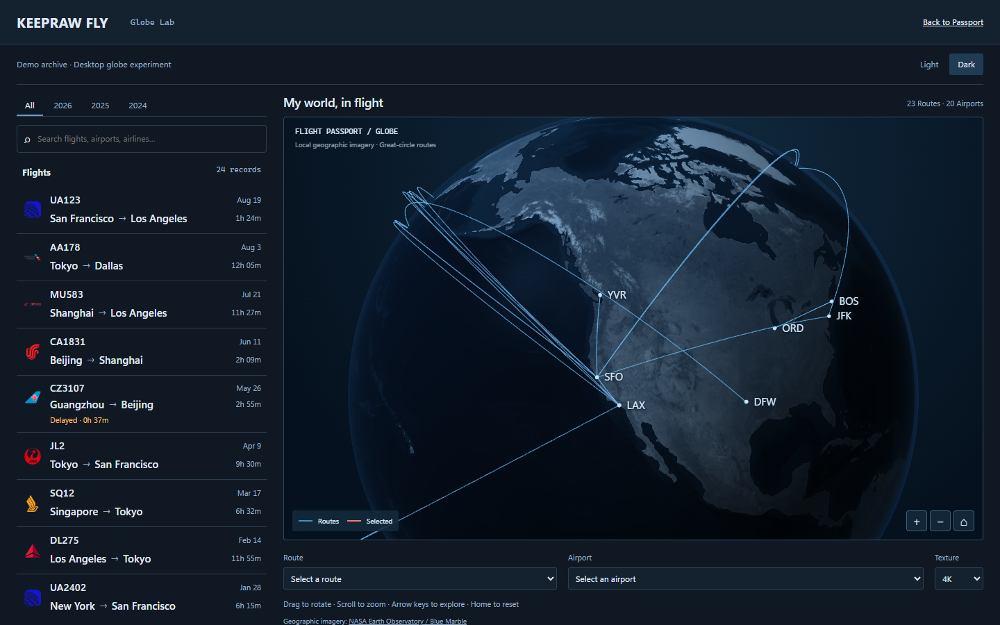
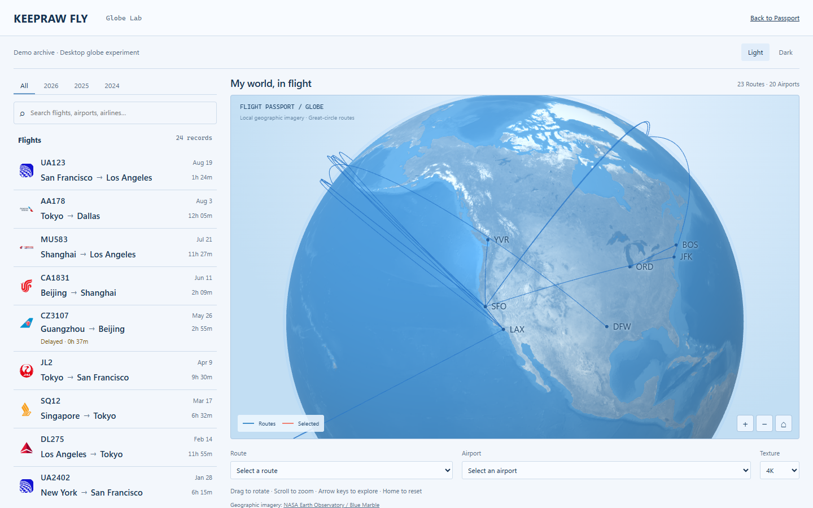
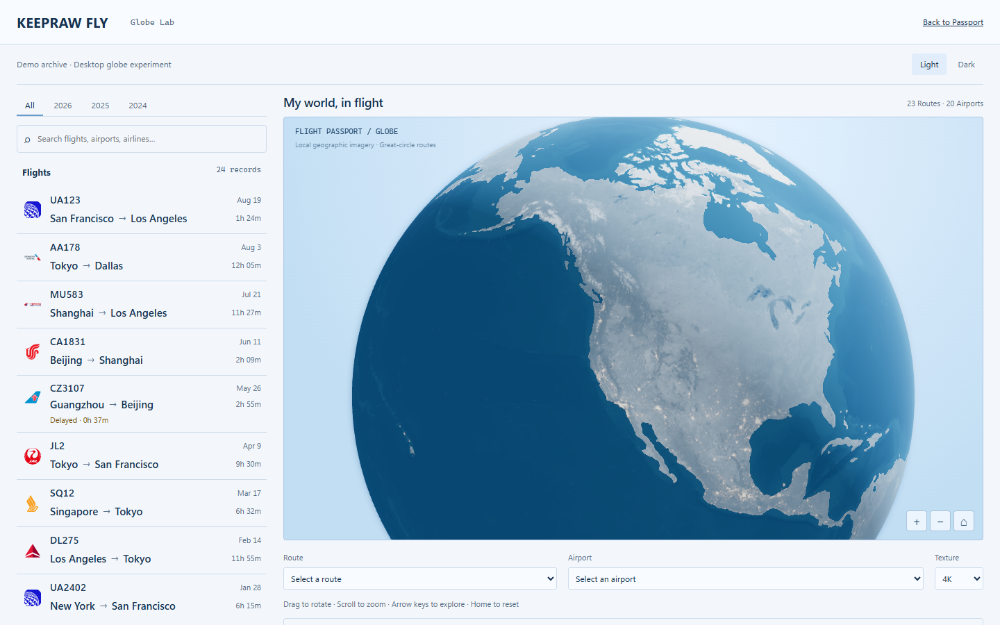
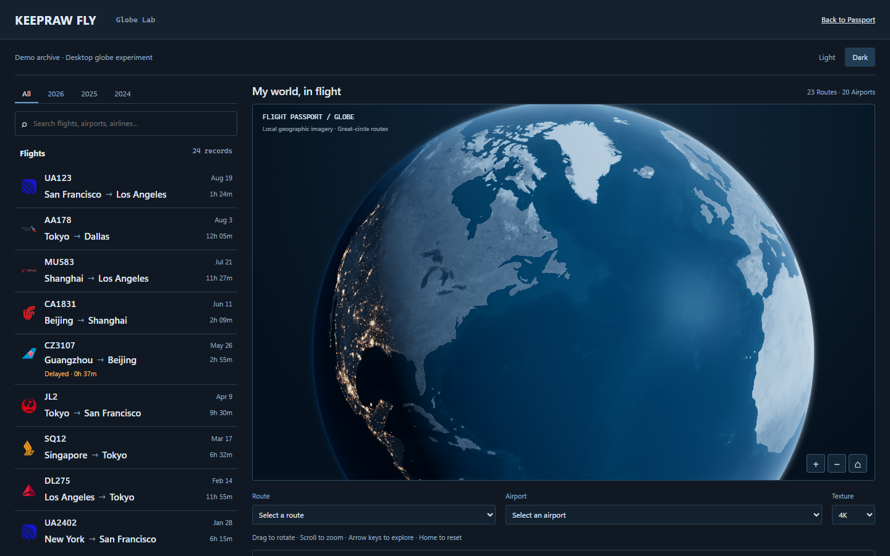
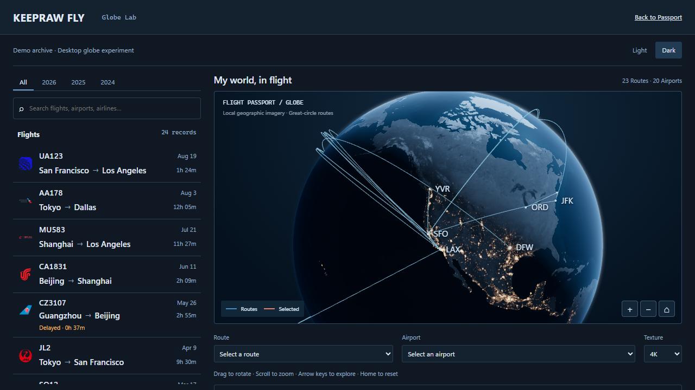
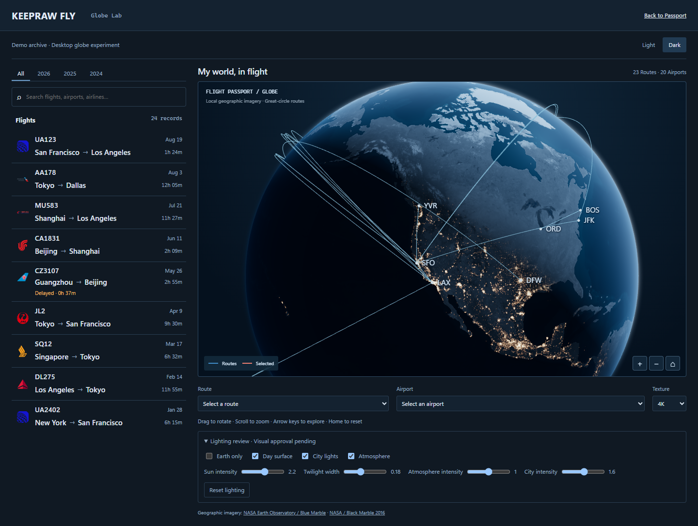

# Task 1B-1 browser evidence

**Visual approval pending — Draft experiment review only.**

These are unedited real Chrome screenshots using Intel UHD / ANGLE Direct3D 11,
1440 × 900, DPR 1, local 4K textures and the repository Demo archive (all years,
24 flights, 23 directed routes, 20 airports). The before and after complete views
use exactly the same camera. Before uses the committed Task 1 defaults; after
uses the designed Task 1B-1 defaults without screenshot-specific tuning.

## Same-camera comparison

| Theme | Before                                          | After                                         |
| ----- | ----------------------------------------------- | --------------------------------------------- |
| Dark  |    |    |
| Light |  |  |

## Earth-only and additional views

| View                                            | Screenshot                                        |
| ----------------------------------------------- | ------------------------------------------------- |
| Dark Earth only, 1440 × 900                     |      |
| Light Earth only, 1440 × 900                    |    |
| Dark rotated, cities and terminator, 1440 × 900 |       |
| Dark complete, 1280 × 720                       |         |
| Dark full page with lighting controls           |  |

## Measurements and reproduction

- [Implementation, tests, performance and visual limitations](../../globe-cinematic-lighting.md)
- [Manifest: source commits, dimensions and SHA-256](manifest.json)
- [Before screenshot configuration](before-measurements.json), [after configuration](after-measurements.json)
- [Before hardware](before-hardware.json), [after hardware](after-hardware.json)
- [Before SwiftShader](before-software.json), [after SwiftShader](after-software.json)
- [Chrome/Edge hardware attempts](hardware-attempts.json)
- [Chromium layer pixel check](chromium-lighting-pixels.json), [WebKit layer pixel check](webkit-lighting-pixels.json)
- [Chromium accessibility](chromium-accessibility.json), [WebKit accessibility](webkit-accessibility.json)
- [Experiment bundle audit](bundle-audit.json), [unchanged production assets](production-isolation.json)
- [Test outcomes and Firefox launch limitation](test-results.json)

The screenshots and JSON are deliberately committed for remote review. The
general `/artifacts/` output remains ignored. PNGs can be opened directly from
this public repository; the PR embeds commit-pinned raw image URLs.

No PR merge, automatic merge, changes to PR #33, or replacement of the production
Passport map are authorized by this evidence. Visual acceptance requires review.
