# Task 1B-3 — A/B visual review

**Visual approval pending. A is the requested default candidate; final selection belongs to the project owner.**

[Art direction diagnosis, implementation, tradeoffs and tests](../../globe-art-direction.md) · [All PNG dimensions / hashes / camera and source provenance](manifest.json)

Rendered source: `2efd89b6bb6ea87a832ca6eecc1359e6c709a4d1`. Baseline: `b9d32b3be9b6791a5a2861846d220c96ca0d59f0`. All 24 PNGs are direct, unedited Chrome WebGL screenshots on Intel UHD / ANGLE D3D11, DPR 1 / 4K. The unchanged Demo contains **24 flights, 23 directed routes, 22 physical strokes, 20 airports, all years** in every image. Earth-only hides overlays, without filtering flights or changing the camera. Selected views retain the full data and select the same real PEK→PVG route.

The capture script asserts exact scene/camera/FOV/ViewOffset/viewport/route equality with the baseline for every A/B view, plus the same world sun and exposure. Default Home at 1440×900 uses camera `[-1.1462179214868498,0.5012782172755569,-1.6866845067609426]`, FOV 34°, map client 1006×608, exposure 1, sun `[-0.2926889023874383,0.290121517531001,0.9111326530669097]`. Small, selected and measured-size views each use their matching baseline camera; details are in [before scenes](before-scenes.json) and [after scenes](after-scenes.json). Click images for original-size inspection.

## Dark — 1440×900

| View / full Demo                             | Task 1B-2 baseline                                                                                               | A · Restrained Midnight Aviation                                                                       | B · Subtle Horizon Twilight                                                                            |
| -------------------------------------------- | ---------------------------------------------------------------------------------------------------------------- | ------------------------------------------------------------------------------------------------------ | ------------------------------------------------------------------------------------------------------ |
| Complete route network · default Home camera |  | 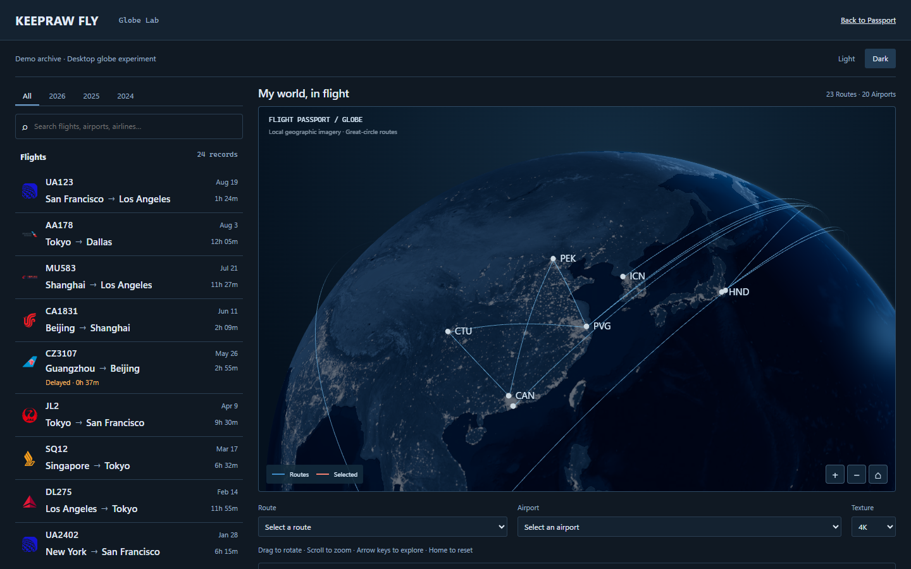 |  |
| Earth only · same default Home camera        | 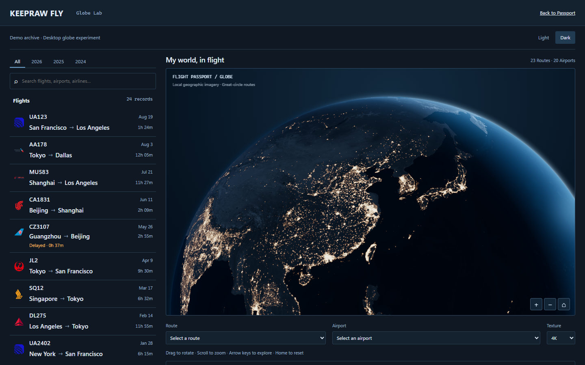   | 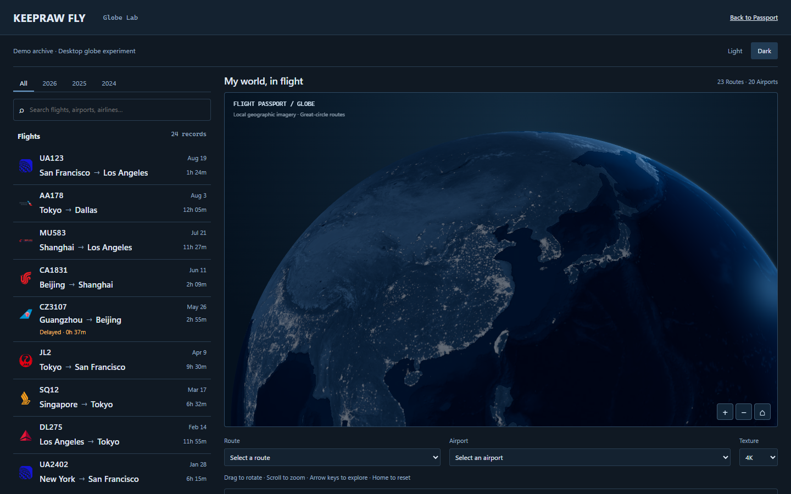   |    |

A moves attention from pale city clusters to thin blue flights against textured navy land. B changes the local lit rim and adds a small cold-white shoulder, with the same city response and exposure. Neither is a final visual approval.

## Light — 1440×900

| View / full Demo                             | Task 1B-2 baseline                                                                                                 | A                                                                                                        | B                                                                                                        |
| -------------------------------------------- | ------------------------------------------------------------------------------------------------------------------ | -------------------------------------------------------------------------------------------------------- | -------------------------------------------------------------------------------------------------------- |
| Complete route network · default Home camera | 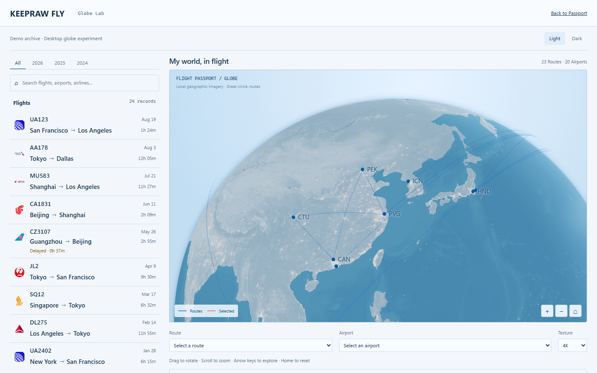 |  | 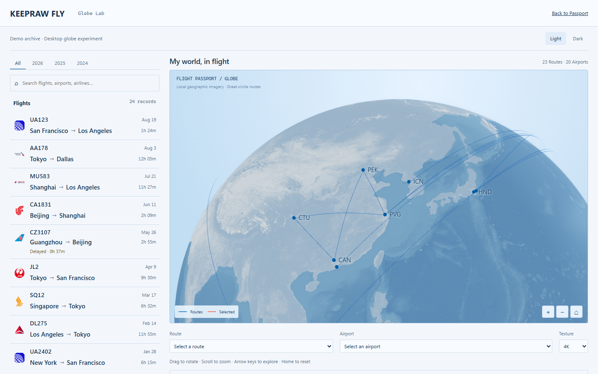 |
| Earth only · same default Home camera        | 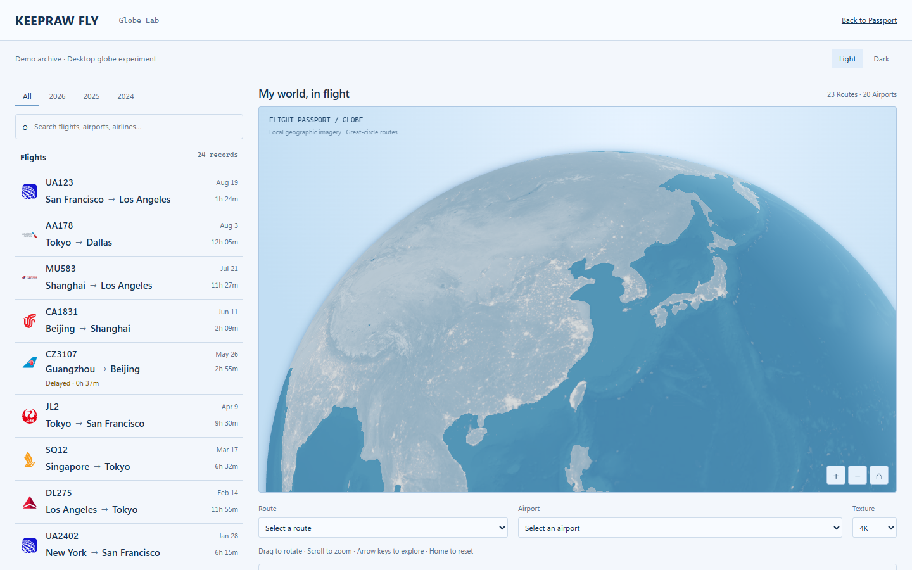   |    | 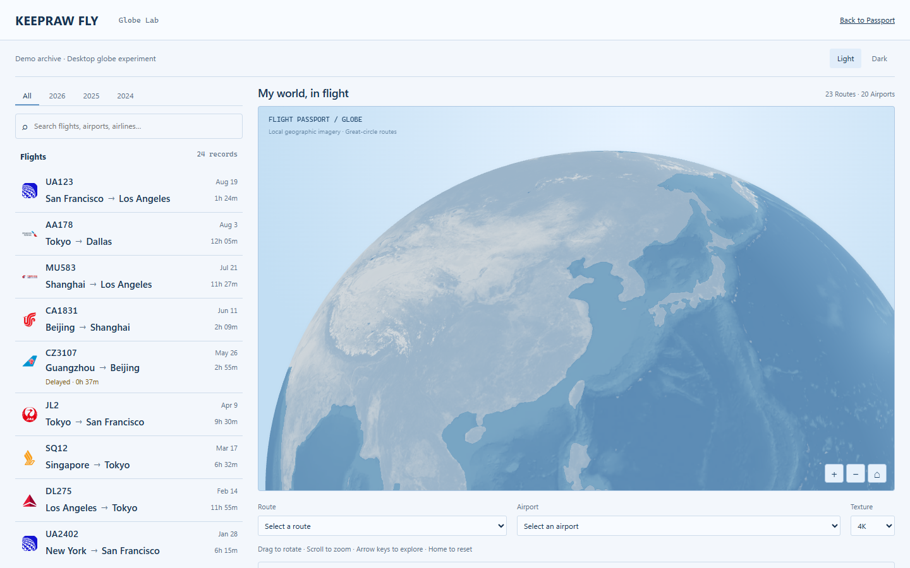   |

Light shares the same cool terrain/water response in A/B. Only the local horizon changes slightly; nighttime city emission is suppressed. The more distinct mountains, coastline and seabed are intentional, while the grade still has less photographic depth than concept 04.

## Small viewport — Dark 1280×720

Full Demo, same aspect-specific B2 Home camera in all three; client map 860×428.

| Baseline                                                                                                         | A                                                                                                      | B                                                                                                      |
| ---------------------------------------------------------------------------------------------------------------- | ------------------------------------------------------------------------------------------------------ | ------------------------------------------------------------------------------------------------------ |
|  | 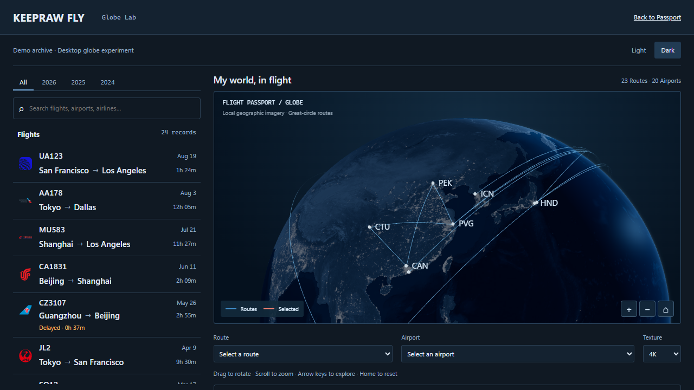 |  |

## Selected real route — Dark 1440×900

Same selected-route camera and full unfiltered archive in every image. PEK→PVG's coral stroke and endpoints are the focal point. A/B switching preserves this selected camera.

| Baseline                                                                                                           | A                                                                                                        | B                                                                                                        |
| ------------------------------------------------------------------------------------------------------------------ | -------------------------------------------------------------------------------------------------------- | -------------------------------------------------------------------------------------------------------- |
| 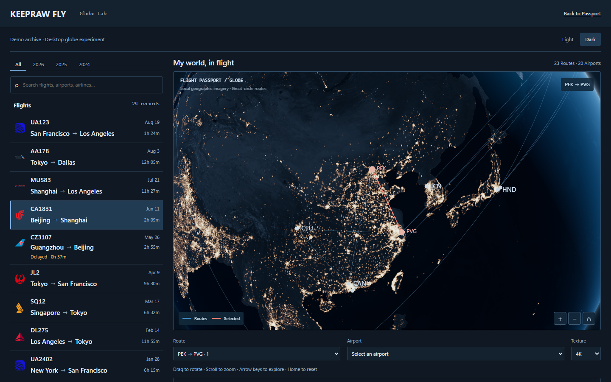 | 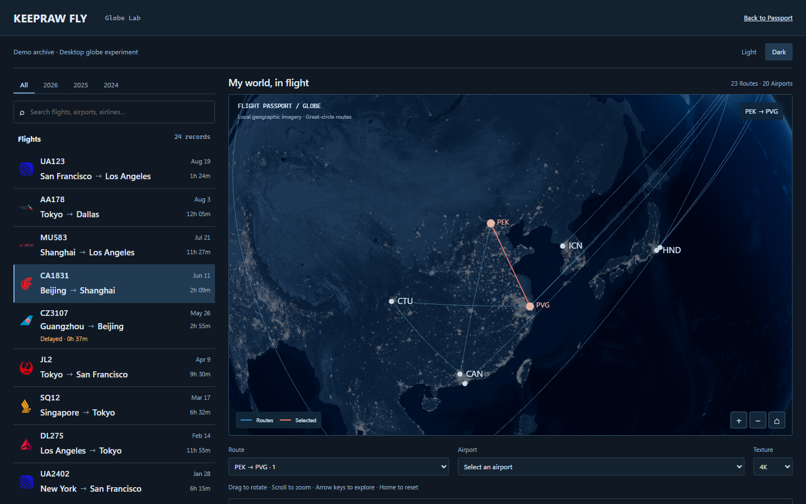 | 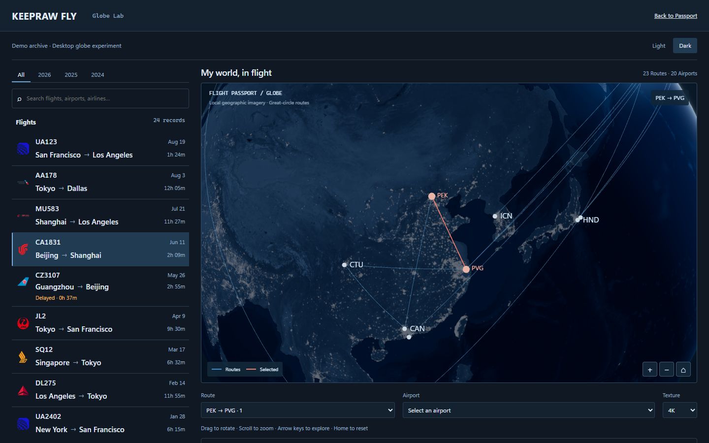 |

## Measured formal Passport map size — preview inside Globe Lab

Read from the existing formal Desktop Passport layout after loading the Demo at 1440×900: **outer frame 998×576.0625 CSS px; client canvas 996×574; 1 px border**. The Lab stage alone takes these actual measured dimensions. Its Home camera is supplied by the unchanged composition algorithm, and baseline/A/B match exactly. These are Lab screenshots, not a formal Passport integration or a modified formal page.

| Mode · 1440×900 browser · measured-size Home camera · full Demo | Baseline                                                                                                                             | A                                                                                                                          | B                                                                                                                          |
| --------------------------------------------------------------- | ------------------------------------------------------------------------------------------------------------------------------------ | -------------------------------------------------------------------------------------------------------------------------- | -------------------------------------------------------------------------------------------------------------------------- |
| dark                                                            | 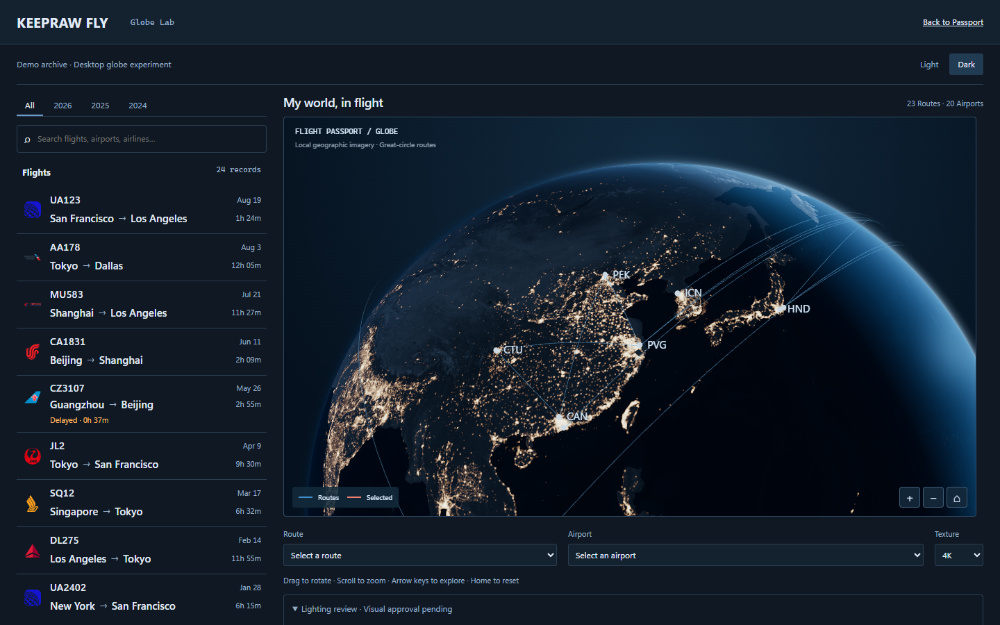   | 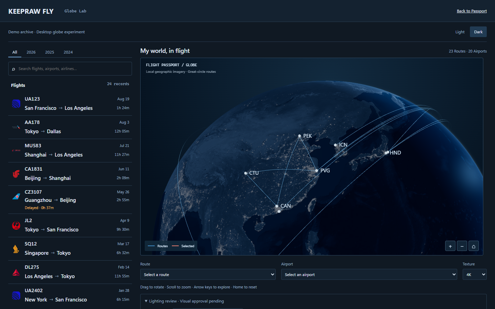   | 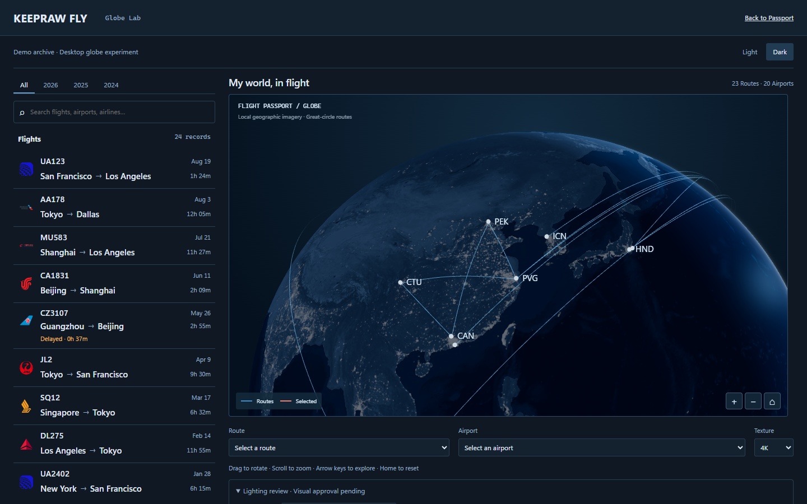   |
| light                                                           | 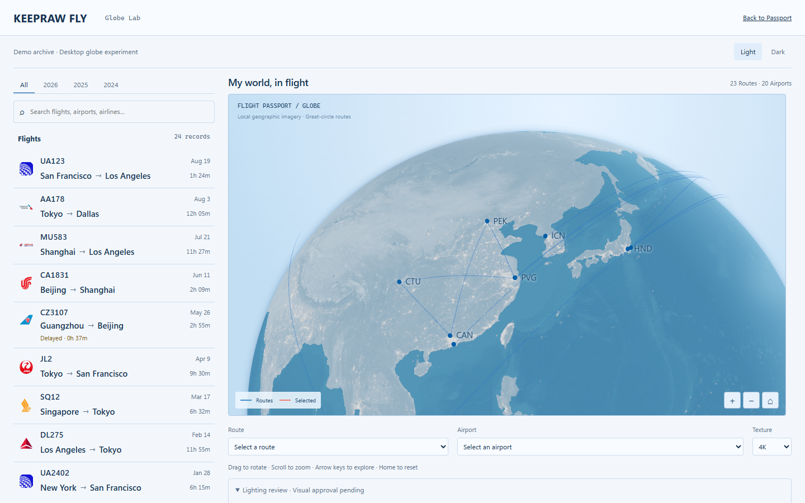 | 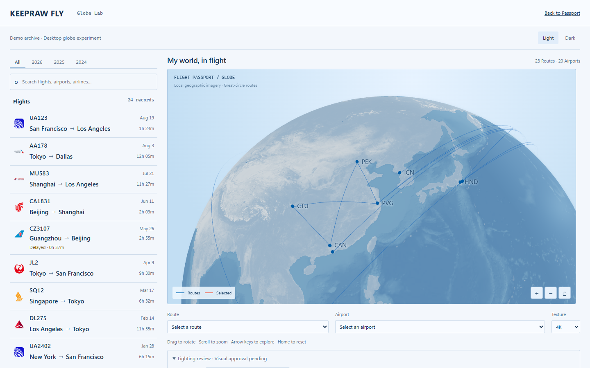 |  |

## Advantages and remaining gaps

A is quieter and gives the flight network consistent priority; its horizon can feel austere. B adds more spatial separation near the light; selected/limb views can reveal a synthetic edge, and grazing strokes meet a brighter local background. The dense real city distribution remains perceptible but no longer creates white-gold LED clusters. Both keep the existing blue map-like surface grading, clustered limb routes and limited photographic/cloud complexity relative to the concept. Light A/B differ only slightly. Review at full size; neither lower brightness nor passing tests proves conceptual acceptance.

## Verification and raw evidence

- [Structured test results and historical/new failure distinction](test-results.json): units 301 passed, Globe Chromium 9 + WebKit 9 passed, formal Passport Chromium 3 + WebKit 1 passed. Local Firefox cannot launch; not verified. Initial six-worker readiness failures and revised obsolete orange pixel assumption are explicitly recorded. No timeout or workflow changes.
- [Chromium pixel layers](chromium-lighting-pixels.json) · [WebKit pixel layers](webkit-lighting-pixels.json): city on/off causes actual pixel changes; restored layer is identical; all-layers-disabled inner sphere luminance remains zero. These are functional checks, not aesthetic approval.
- [Chromium accessibility](chromium-accessibility.json) · [WebKit accessibility](webkit-accessibility.json): Light/Dark zero Axe violations.
- [Hardware baseline](before-performance.json) · [A](a-performance.json) · [B](b-performance.json): same Intel UHD D3D11 / 1440×900 / camera/sun/data. 2K and 4K all approximately 60 observed RAF Hz, 42 default draw calls, zero idle frames. Single runs; refresh cap is not proof of spare GPU capacity.
- [Production isolation](production-isolation.json): all nine formal assets equal B2 in names, bytes and SHA-256. [Independent renderer bundle](bundle-audit.json): +1,679 B JS / +769 B gzip; no texture/pass/geometry additions.
- Historical [B2 CI 37902087619](https://github.com/keepraw/Keepraw-Fly/actions/runs/37902087619): WebKit passed; Firefox readiness and Chromium motion-camera failures preceded B3. New remote CI is reported separately in PR #34.

[Task 1B-1 history](../task-1b-1/README.md) · [Task 1B-2 history](../task-1b-2/README.md). Formal SVG, camera math/arc heights, interactions, business data and assets are frozen. **Stop visual expansion here; Visual approval pending.**
