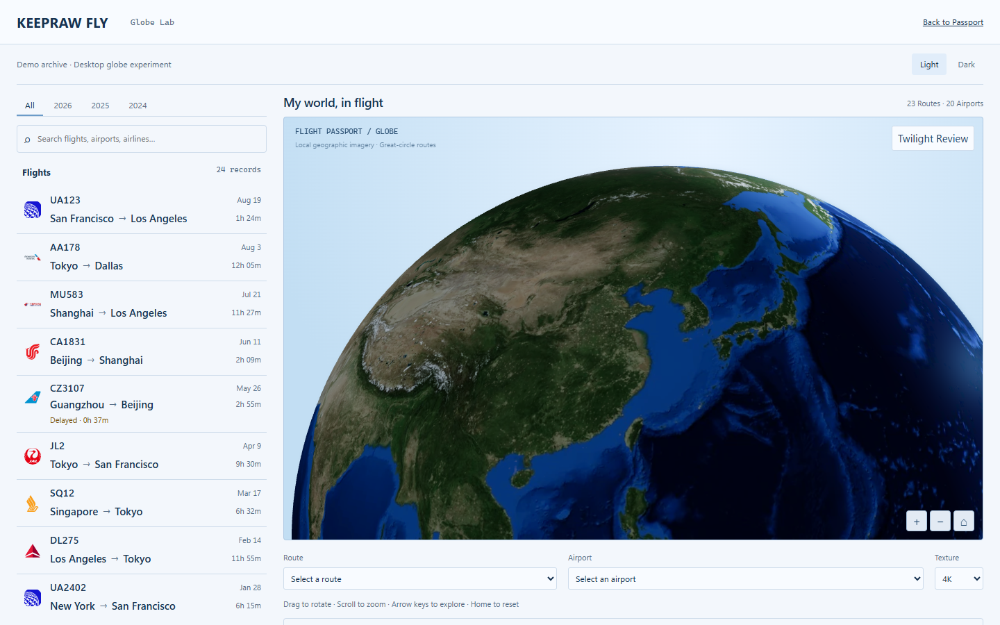
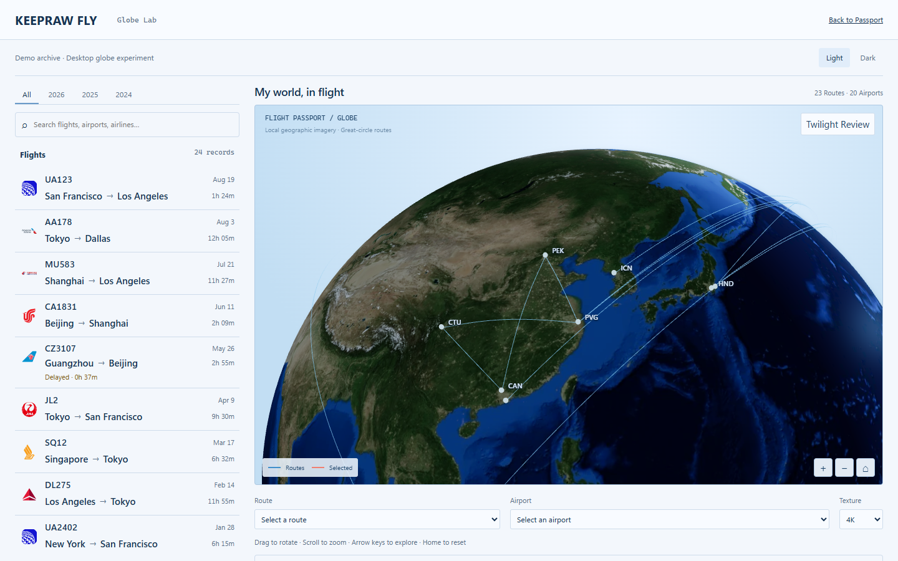
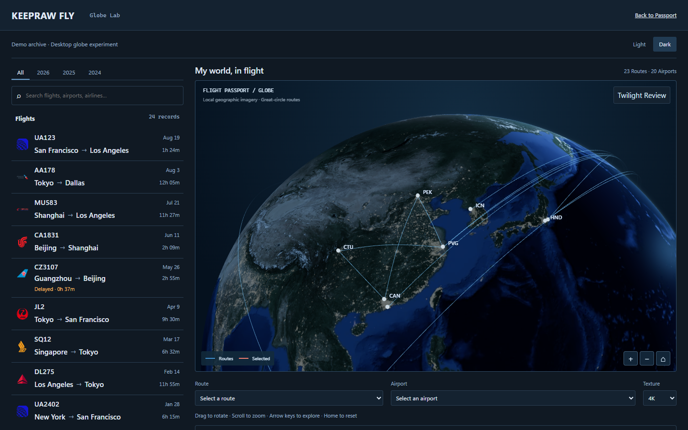
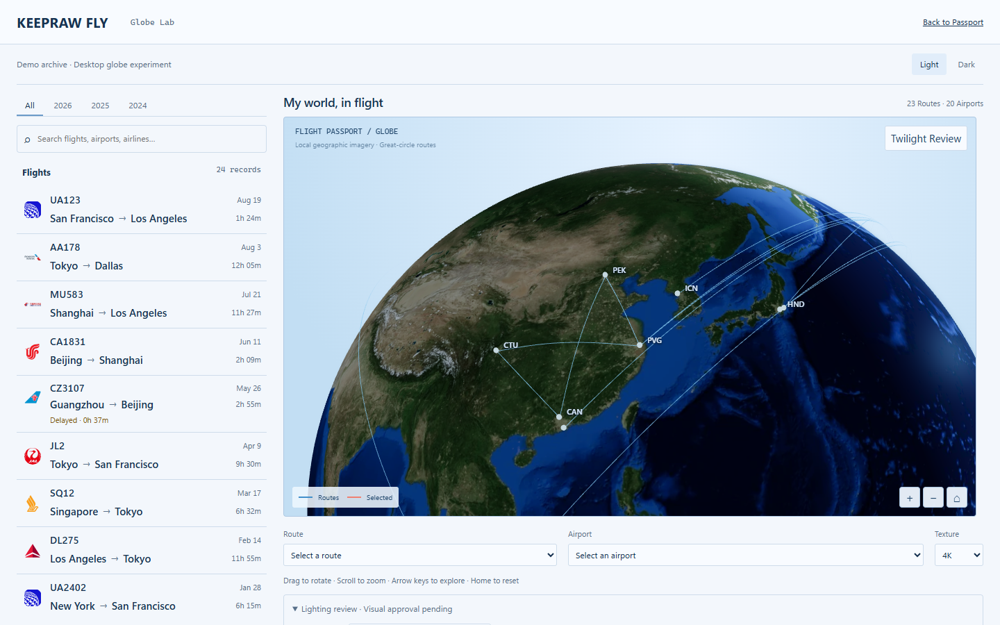
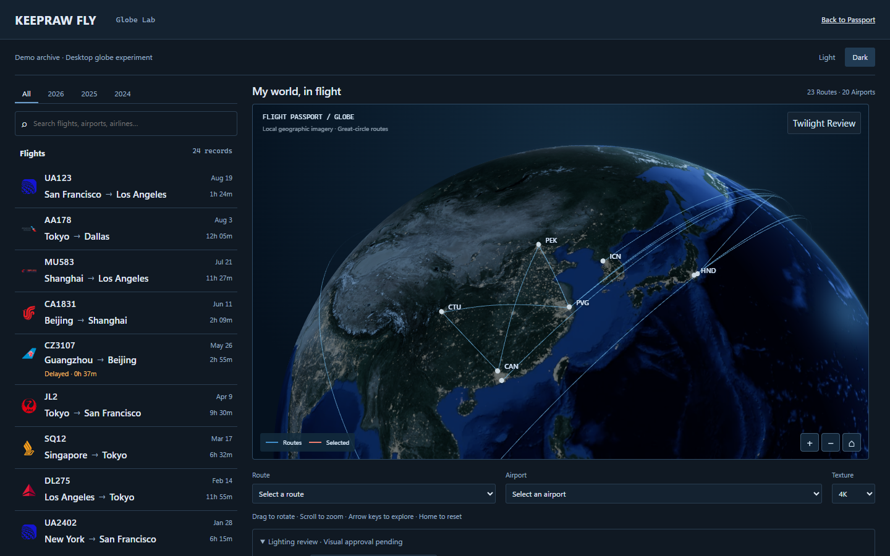
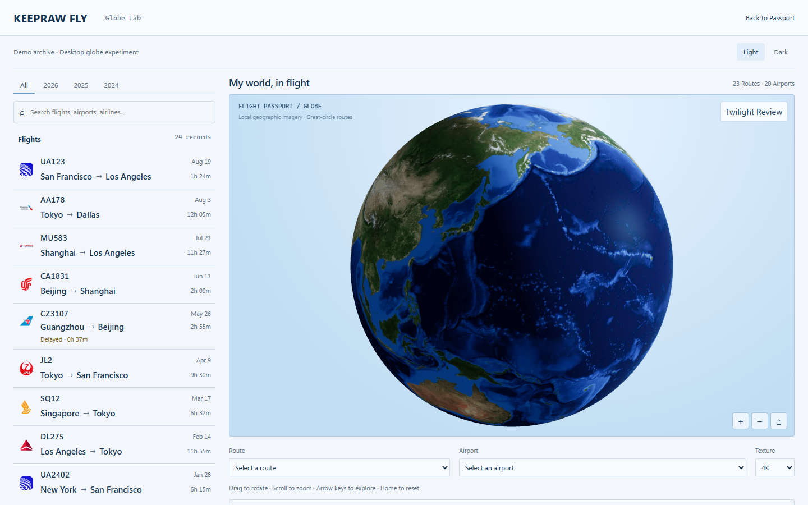
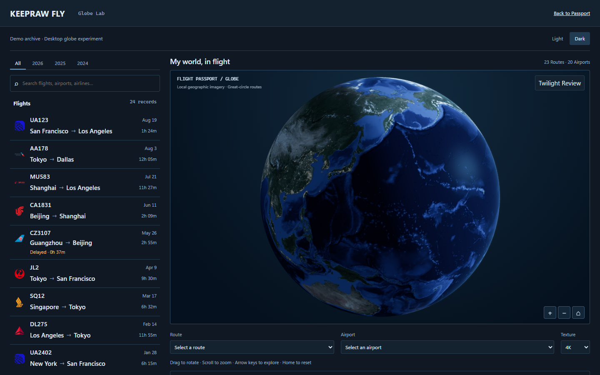
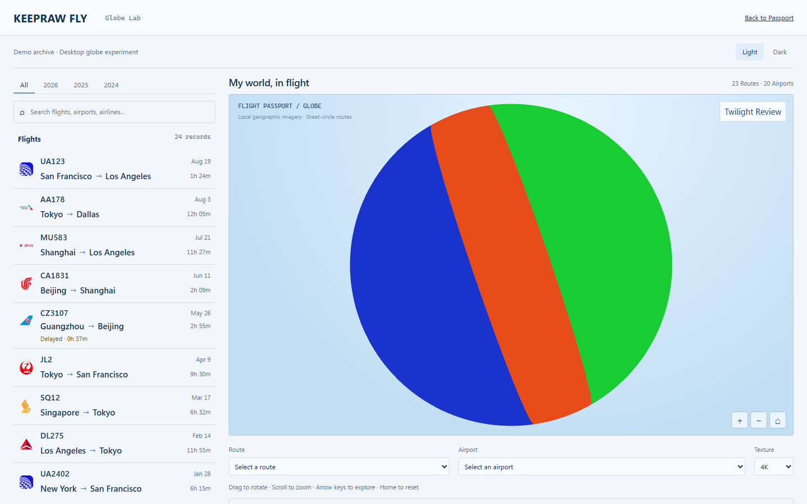
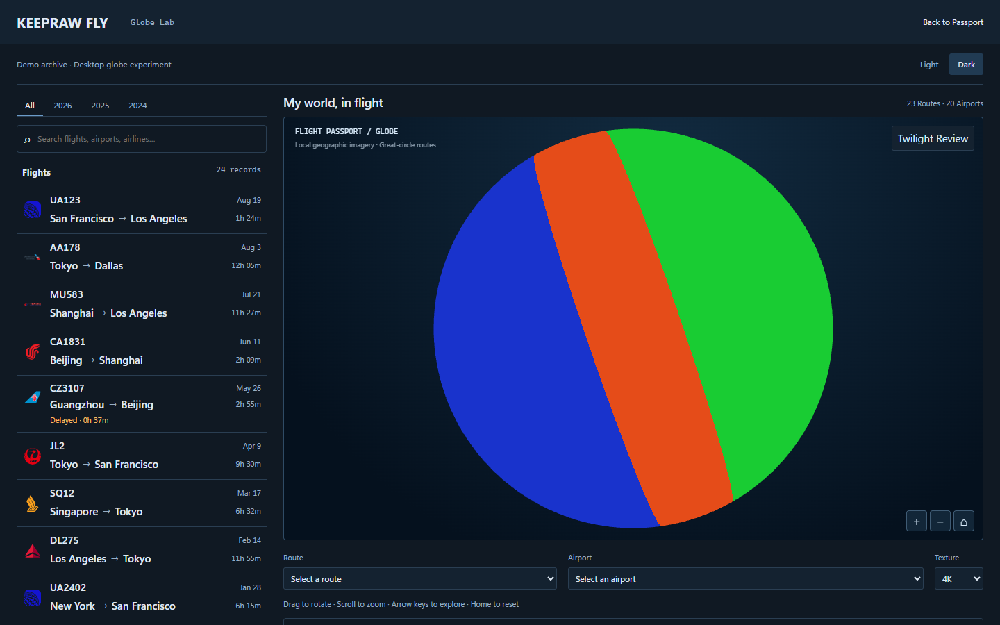

# Task 1B-4 Globe 昼夜光照与地表材质审查

**Visual approval pending。保留 Draft PR #34，等待项目负责人视觉审查。**

本轮拆开 Geographic Surface、Solar Illumination、Theme Color Grading。Light/Dark、A/B 共享世界太阳、入射角、暮光和夜光遮罩，地表保留 NASA 原始颜色与纹理。源码提交 `2a7e67f8267ed9fce306d1315d374dd02aa65ac2`；Before 为第三轮 `38c61266915edc1252769c305623d56a1ffb563e`。工程检查已完成，视觉品质仍需人工验收。

[截图来源与完整场景](manifest.json) · [GPU 像素验收](solar-pixels.json) · [测试记录](test-results.json) · [生产资产隔离](production-isolation.json) · [纹理检查](texture-inspection.json)

## 第三轮前后对照

Before 直接引用第三轮既有资料。默认和正式尺寸 After 逐一断言相机、FOV、ViewOffset、viewport、完整航线元数据、太阳及曝光与对应 Before 相同；每组 Light/Dark 也断言场景一致。

| 视图               | Task 1B-3 Before                                                      | Task 1B-4 After                                      |
| ------------------ | --------------------------------------------------------------------- | ---------------------------------------------------- |
| Light 地球本体     |              |              |
| Dark 地球本体      |                |                |
| Light 完整航线     |            |            |
| Dark 完整航线      |              |              |
| Light 正式地图尺寸 |  |  |
| Dark 正式地图尺寸  |    |    |

## 同一暮光视角

Twilight Review 将相机朝向 Home 方向在太阳垂直平面上的投影，距离 3.6、无 ViewOffset。只改变审查相机，不改变太阳。不是要求所有 Home 或选中镜头都显示晨昏线。

| Light                                              | Dark                                             |
| -------------------------------------------------- | ------------------------------------------------ |
|          |      |
|  |  |

绿色为 Day，橙色为 Twilight，蓝色为 Night。两种主题球面分区一致，背景随界面主题变化。这些分类色仅用于开发审查，不是正式地球的光照边缘。

## 模型与材质

太阳保持第三轮原值 `[-0.2926889023874383, 0.290121517531001, 0.9111326530669097]`，曝光保持 1。没有重定位太阳、添加或替换纹理。

地表与大气共用 `solarResponse`：Day 采用 `smoothstep(-width,width,solar)`，Twilight 在 `abs(solar)=0` 处最强，夜光向强日照自然衰减。地表照明统一为 `.32 + sunIntensity * pow(max(solar,0),.65) * day`。主题不参与太阳区域或照明能量计算；低强度填充保留背光地貌。

移除第三轮 `lightLand/land/sea` 的固定颜色区间，保留真实植被、沙漠、高原、雪地和海底的线性 RGB。连续亮度暗部曲线扩展深海与植被细节，然后照明，再做 Light/Dark 去饱和与冷色平衡。材质曲线是有意的反照率分级，不是第二次 Gamma 解码。没有提高全局曝光或叠加白雾。

已实际打开原始纹理，并检查八个地理像素。撒哈拉、塔里木、西藏、喜马拉雅、格陵兰、亚马孙样本的旧海洋权重为 0，日本近岸为 0.934，太平洋为 1。样本没有证明旧分类普遍错误，也不是完整海陆验证。本轮蓝色优势只控制低幅度海面反射，不再决定固定材质颜色，因此局部分类误差不再抹除原影像；不新增遮罩。

已核对本机 Three.js `WebGLTextures`：表面 `SRGBColorSpace` 通过 sRGB GPU 内部格式解码一次；夜光保持 `NoColorSpace`；照明与分级在线性空间完成，最终一次 ACES Filmic、一次 sRGB 输出。删除第三轮为固定调色执行的线性转 sRGB 再转回路径。

夜光保留第三轮 `.012` 阈值、toe、1.25 中间调及有界肩部。主题响应 Light 0.45 / Dark 1，二者均乘同一地理 Night 遮罩。低饱和真实夜光保留，没有恢复白金 LED 峰值。暮光围绕真正的当地地平线响应，夜侧大气逐渐衰减。B 只增强局部暮光与原壳层窄散射裙边，A/B 不改变昼夜分布。

Light 普通航线与机场使用较亮冷蓝色，标签加深色阴影，适应真实地表暗部。只微调颜色、有限透明度，保留大圆几何、高度、线宽、球面遮挡与选中珊瑚路线。

## 对照概念图 01 与 04

已实际打开用户上传的原展板及要求的七张第三轮截图。

对照 04，真实沙漠、高原、植被、雪地与海底层次替代统一浅蓝灰色，球面亮度由太阳入射角控制。但 Home 中心原本位于夜半球，所以本轮 Light Home 仍比概念图 04 日照构图深；浅色界面不能使该地理区域永远白昼。暮光镜头用于检查同一材质的日夜响应。海底反差较明显、局部海洋偏钴蓝，与概念图通透柔和的日间摄影感仍有差距，不能宣布塑料质感或视觉验收已完全解决。

对照 01，Dark 保留海军蓝背景、克制城市夜光与纤细航线，地形和右上方受光方向更明确。概念图跨欧洲、中东与亚洲，本轮没有改变真实 Demo 或相机算法来追逐相同构图。概念图的云层、地平线与摄影层次更丰富；本轮没有添加云层、Bloom、镜头光斑、光柱或粒子。近地平线真实长途航线仍会聚集，几何不在本轮范围。

## 浏览器与测试证据

十张 PNG 均为未编辑的 Chrome 154.0.8037.58 WebGL 2 / Intel UHD / ANGLE D3D11 截图，1440×900、DPR 1、4K：8 张主要截图、2 张分区诊断。Demo 全部年份保持 24 航班、23 有向航线、22 物理笔画、20 机场，无选中路线。Earth-only 仅隐藏覆盖层。

正式 Desktop Passport 外框重新实测 **998×576.0625 CSS px**，client **996×574**。仅在 Lab 预览该尺寸，正式 Passport 仍使用原 SVG。

自动化独立重建截图透视射线与世界球面法线，与实际 GPU 分类比较。每个 Light/Dark、A/B 场景覆盖 **54,677** 个非掠射样本，误分类 **0**，分区签名一致。城市开关不改变分区和相机。同一 Shader 的中性反照率探针排除海洋与大陆亮度差异，验证实际 GPU 照明路径。

| 主题      | 中性材质白昼亮度 | 暮光亮度 | 夜间亮度 | 夜间城市变化样本 |
| --------- | ---------------: | -------: | -------: | ---------------: |
| Light A/B |           160.03 |    78.07 |    57.02 |              869 |
| Dark A/B  |           128.39 |    55.73 |    38.90 |             1060 |

亮度为截图 sRGB 加权值 0–255；城市变化阈值为任一通道差值 >2。两个主题白昼城市增量均为 0。真实地表同时验证白昼均值高于夜间、各区保留非黑细节；暮光深海可能比夜间大陆暗，完整原始均值保存在 solar-pixels.json。

最终 Chromium **13/13 passed**：原 Globe 9 项、新太阳 GPU 1 项、正式 Passport 3 项。原有 Canvas 身份、世界光源、纹理请求、按需渲染、旋转缩放、机场航线选择、Home、地理遮挡、降级重试和可访问性检查均保留。本轮未重跑完整 Firefox/WebKit 矩阵，不声明其他引擎完成新照明验收。

全仓 **304** 项单元测试、typecheck、build、文档一致性、CSS lint/tokens、修改文件 Prettier、diff 检查通过。正式九个生产资产名称、字节和 SHA-256 与第三轮资料相同。没有正式产品新增成本。未做新性能矩阵，静止按需渲染检查通过；没有新增贴图、pass 或几何。

开发中的新测试修正：等待实际暮光相机帧；增加同一 Shader 中性材质探针排除地貌反照率干扰；球面分区比较排除透明 Canvas 的主题背景。没有修改既有回归断言、超时、重试或 CI。

初次现有回归 10/12 通过，Passport Light/Dark 的 `heightFits` 断言失败；另一同时执行的 Playwright 进程还造成共享输出目录附件错误。随后完整第三轮快照（含 public）2/2 通过，最终顺序复测 13/13 通过。高度失败原因未确定，不宣称它已证明为既有缺陷。

## 既有远端 CI

第三轮 [CI 37908031801](https://github.com/keepraw/Keepraw-Fly/actions/runs/37908031801) 已核实失败：Chromium 108 通过 / 1 项原 motion-camera 断言失败；Firefox 17 通过 / 8 项 Globe readiness 或相关失败；WebKit 成功。本轮未扩展交互或 CI 修复，不根据本地通过推断远端问题已解决。新提交 CI 状态单独记录于 PR。

[Task 1B-1](../task-1b-1/README.md) · [Task 1B-2](../task-1b-2/README.md) · [Task 1B-3](../task-1b-3/README.md)。**停止进一步开发，Visual approval pending。**
