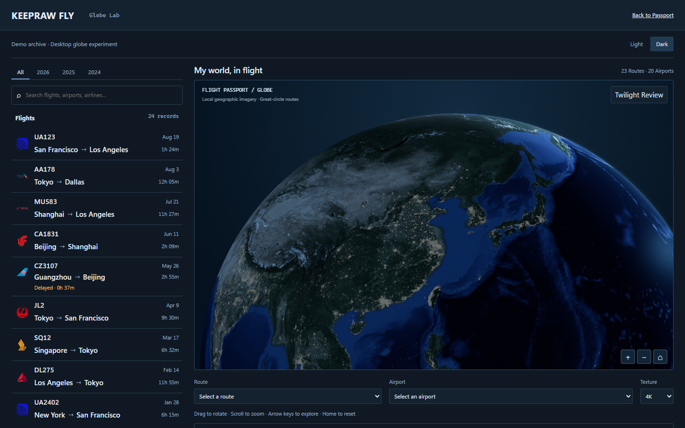
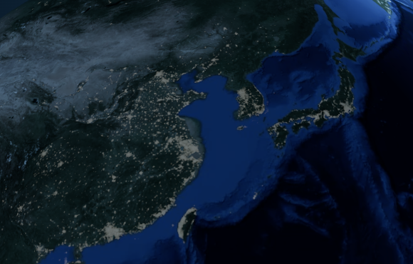
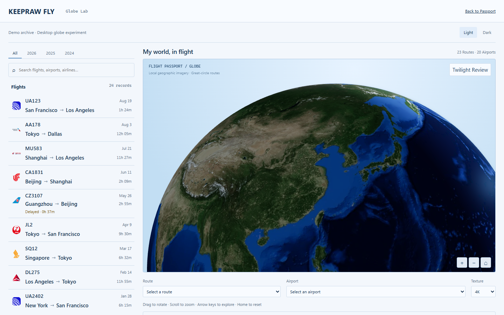
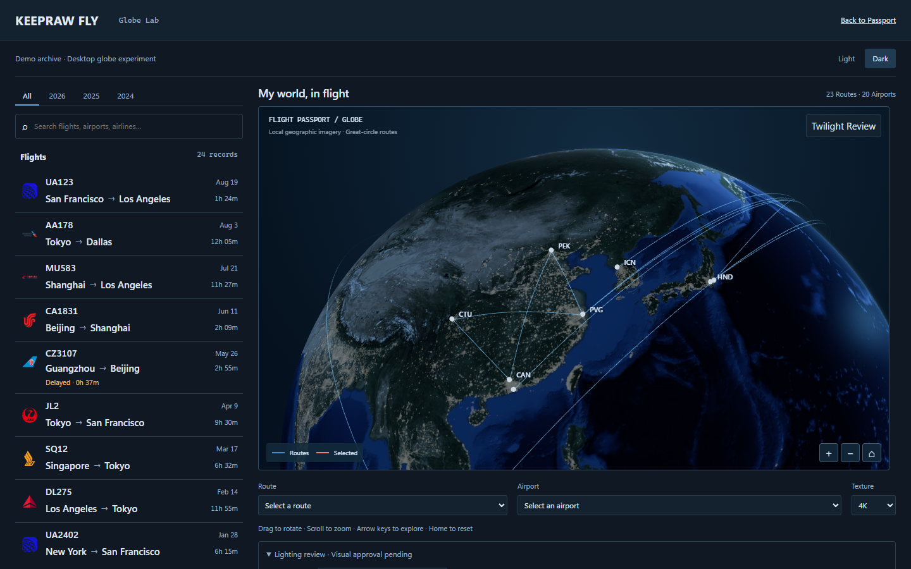

# Task 1B-5 Night lights dynamic range review

**Visual approval pending. Draft PR #34 remains an isolated DEV-only Globe Lab experiment.**

The real urban information survives the NASA source and both packaged textures. The main loss was the compounded 0.075-wide toe and power 1.25 midtone suppression introduced in B3 and retained by B4. B5 restores low/mid peripheral detail while keeping the same noise floor, warm-neutral palette and brightest scalar output.

[Pre-change diagnosis and all regional source / 4K / 2K distributions](diagnosis.md) · [Texture audit and histograms](texture-audit.json) · [Final display pixels](display-pixels.json) · [Scene provenance and screenshot hashes](manifest.json) · [Tests and known CI limitations](test-results.json) · [Production isolation](production-isolation.json)

Starting checkpoint: `2720002ef01845aa1b04bb31fce6d619a54a30bf`. Rendered source commit: `9eee6efbe30c22128e16e67d8d8b4fbffc04a080`. Audit/chart scripts use the available Node 24 built-in TypeScript stripping and installed Chrome; the original JPEG stays in ignored `artifacts/task-1b-5` and is checksum-verified. Product/runtime Node requirements are unchanged. Original provenance: [NASA Earth at Night maps](https://science.nasa.gov/earth/earth-observatory/earth-at-night/maps/) and the checked-in texture source metadata. This is a historical grayscale visualization, not calibrated or live luminance.

## Fixed-camera visual comparison

The baseline full-page PNG is referenced directly, avoiding a duplicate. Six new PNGs total approximately 3.41 MB. Every product image is actual unedited Chrome 154.0.8037.58 WebGL 2 / Intel UHD / ANGLE D3D11 output at 1440×900, DPR1, 4K, exposure1, art A. Demo retains all years, 24 flights, 23 directed routes, 22 physical strokes, 20 airports and no selection. Camera, Home offset, FOV, complete route metadata, viewport and every lighting setting are asserted identical to B4, including its world sun `[-0.2926889023874383, 0.290121517531001, 0.9111326530669097]`.

| B4 Dark Earth only                                     | B5 Dark Earth only                   |
| ------------------------------------------------------ | ------------------------------------ |
|  |  |

| B4 East Asia detail                   | B5 same East Asia detail             |
| ------------------------------------- | ------------------------------------ |
|  |  |

The details are browser screenshot clips at x650/y310, 580×370 CSS pixels from the identical 1440×900 Home view. They do not zoom, move the camera, rescale or edit pixels. The B4 clip comes from a source/public snapshot of the starting checkpoint on the same browser/GPU.

| B5 Dark full routes           | B5 Light same Earth-only scene |
| ----------------------------- | ------------------------------ |
|  |    |



The official Passport outer map was remeasured at 998×576.0625 CSS px (client 996×574); the Lab preview asserts the corresponding B4 scene. The actual product still uses SVG.

## Response design

```glsl
s = max(input - .012, 0.0);
toe = smoothstep(0.0, .035, s);
lights = .1044 * (1.0 + .12 / .988) * s / (.12 + s) * toe;
```

The smooth toe limits residual background; the rational midtone scale restores real peripheral signals without a suppressive power; normalization bounds the brightest valid input at 0.1044. The three controls are toe width, midtone shoulder scale, and peak. This is C1-continuous, monotonic and deterministic over the texture range. The global nightIntensity stays 1. Shared solar mask, Light .45 / Dark 1 strengths and palette remain unchanged. No texture, renderer, camera, route geometry, atmosphere, day surface, UI, production configuration or dependency changed.


| Input | B2 (default intensity 1.6) |    B3/B4 |       B5 |
| ----: | -------------------------: | -------: | -------: |
|     0 |                   0.000000 | 0.000000 | 0.000000 |
| 0.012 |                   0.000000 | 0.000000 | 0.000000 |
|  0.02 |                   0.026409 | 0.000041 | 0.000972 |
|  0.04 |                   0.076596 | 0.001860 | 0.019847 |
|   0.1 |                   0.202736 | 0.021640 | 0.049534 |
|   0.2 |                   0.386504 | 0.044237 | 0.071465 |
|   0.5 |                   0.869515 | 0.081842 | 0.093972 |
|     1 |                   1.583665 | 0.104531 | 0.104400 |

The historical chart includes default intensity and excludes palette and solar mask; B3/B4 are identical only in the scalar response. The separate historical table records changes in color, theme strength and masks. B2 peaks are not a useful target: they were unbounded and strongly colored.

## Actual display evidence

Metrics compare city-on and city-off WebGL screenshots **after ACES and sRGB** at identical Home geometry. Independent perspective rays include the original ViewOffset, intersect the world sphere, and classify the specified city neighborhoods (core ±0.25° about city centers, periphery excludes core). Coverage means any channel increment >2; weighted display increments use 0–255 sRGB values. These are visual diagnostics, not physical photometry.

| Metro           | Visible coverage B4 → B5 % | Periphery mean increment B4 → B5 | Core mean increment B4 → B5 |
| --------------- | -------------------------: | -------------------------------: | --------------------------: |
| beijing-tianjin |              56.54 → 65.30 |                    14.92 → 23.28 |               59.89 → 62.64 |
| yangtze-delta   |              65.27 → 71.24 |                    23.17 → 30.58 |               57.27 → 60.92 |
| pearl-delta     |              46.33 → 52.88 |                    14.05 → 19.73 |               60.43 → 62.89 |
| chengdu         |              27.35 → 34.72 |                      5.16 → 9.91 |               53.55 → 59.61 |
| tokyo           |              44.42 → 51.65 |                    12.29 → 17.97 |               52.29 → 53.74 |
| seoul           |              40.10 → 46.47 |                    12.58 → 18.26 |               66.01 → 67.76 |

Peripheries recover more strongly than cores. Entire sampled sphere coverage rises 6.82% → 9.24%, while maximum city increment changes only 70.11 → 71.11. Near-white pixels (all channels ≥240) remain **0** across 381,675 nongrazing sphere samples in Dark and Light. Route/airport overlay median absolute contrast remains 46.74 in Dark, above the strongest metropolitan peripheral mean 30.58; Light overlay median is 96.64. This metric includes airport markers/labels and ordinary routes, so it supports hierarchy without proving every individual arc dominates every city core.

Tibet has 1,113 visible samples and the offshore Pacific control [150°E,20°N,155°E,25°N] has 3,265: both have **0** city-changed pixels in both themes. An initial [145°E,15°N,155°E,25°N] control included populated Mariana islands; it was replaced with the genuinely offshore box, without changing the sun or camera. Remote Sahara, Los Angeles and the original central Pacific audit bounds are outside this fixed Home view; their real texture distributions are reported, not falsely represented as on-screen measurements. Rare source positives in otherwise dark neighborhoods remain a dataset limitation.

Known-city orientation checks on all three images compare correct coordinates against flipped latitude and flipped longitude. Aggregate correct signal exceeds either mirrored aggregate by >3×; RGB channel agreement and all three provenance hashes are verified. Source/4K/2K native neighborhood bounds round outward to whole pixels and are reported exactly. No city patterns are generated, deleted or spatially masked.

Visual inspection: Beijing/Tianjin, the Yangtze and Pearl deltas, and Korea/Japan retain more surrounding texture, with restrained neutral peaks and visible geographic surface underneath. Cities remain gray-warm rather than saturated gold. Light emission is intentionally subtler against the unchanged brighter material. The unchanged cobalt ocean, contrast and photographic-depth limitations from B4 remain; visual approval is not inferred from these metrics.

## Validation and scope

- `pnpm test`: **307 passed** (core66, validator31, web207, CSS AST3; schema has no tests). Three new unit tests sweep 10,001 inputs and use hash-verified real 2K/4K regional histograms, preserving background, tonal ordering and core bounds.
- Focused Chromium: **14/14 passed**, one worker, no retries/skips: existing Globe9, solar1, new final-output night response1, official Passport3. Existing tests were preserved. New GPU assertions compare periphery recovery against measured B4 outputs, keep core increases limited, test both themes and dark controls, and preserve route hierarchy.
- Typecheck, production build, documentation consistency, CSS lint/tokens, formatting and diff checks pass. All nine bundled production asset names, sizes and SHA-256 hashes remain identical to B4; existing public airline asset directory is excluded from bundled-file enumeration. No extra production cost or full-screen pass.
- Screenshot capture initially failed because the isolated baseline lacked root tsconfig; adding the unchanged file required restarting the helper to invalidate its cached error. These were harness setup failures, before any visual acceptance assertions. Final scene assertions and browser captures succeeded with no console/page errors or external requests.
- No additional timing matrix or full Firefox/WebKit rerun. On-demand/idle behavior remains covered by existing regressions. Build retains its existing >500 kB chunk warning.

B4 remote [CI 38010592259](https://github.com/keepraw/Keepraw-Fly/actions/runs/38010592259), now inspected: verify including full Chromium succeeded; WebKit succeeded; Firefox17 passed / the same eight Globe readiness-related tests failed; deploy was skipped. Earlier B3 [CI 37908031801](https://github.com/keepraw/Keepraw-Fly/actions/runs/37908031801) had Chromium108 passed / one motion-camera failure, Firefox17 passed / eight failures, WebKit success. The B3 motion-camera failure was not reproduced in B4 CI; no fix for it is claimed here. New-head CI is reported separately on the PR.

[Task 1B-4 English review](../task-1b-4/README.md) preserves all historical facts and links. PR #33 is untouched. **Development stopped after this focused submission; Visual approval pending.**
