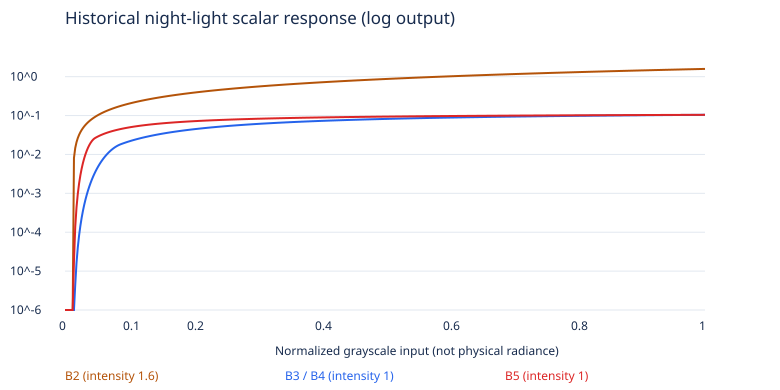

> Historical checkpoint. Superseded PNGs were removed in Task 2; original numerical results remain below. See the [canonical review and cleanup inventory](../task-1b-7b2/README.md). Owner approval now selects Control; historical approval-pending statements describe this checkpoint only.

# Texture audit and pre-change diagnosis

Recorded before modifying the Task 1B-4 emission implementation. Values are normalized historical grayscale visualization signals, **not calibrated luminance**.

All three SHA-256 hashes match the recorded NASA provenance. RGB channels agree in every sampled pixel. Sampling uses longitude -180..180 left-to-right and latitude 90..-90 top-to-bottom; city-center core boxes are ±0.25° in each axis. The wider geographic neighborhoods and native pixel bounds are in [texture-audit.json](texture-audit.json). Periphery excludes core boxes and includes unlit land/water; positive quantiles condition on bytes ≥4, immediately above the existing noise floor. Airport positions are not used.

| Region / resolution           | Near zero % (0..3) | All p90 | Core positive p50 | Periphery positive p10 / p50 / p90 | B3/B4 periphery positive p50 |
| ----------------------------- | -----------------: | ------: | ----------------: | ---------------------------------- | ---------------------------: |
| beijing-tianjin / NASA source |            51.5883 |  0.6706 |            0.8627 | 0.0196 / 0.1451 / 0.7412           |                       0.0326 |
| yangtze-delta / NASA source   |            41.1773 |  0.8431 |            0.8627 | 0.0275 / 0.3216 / 0.8902           |                       0.0637 |
| pearl-delta / NASA source     |            55.7866 |  0.7647 |            0.8824 | 0.0196 / 0.2039 / 0.8039           |                       0.0450 |
| chengdu / NASA source         |            78.0795 |  0.1137 |            0.7137 | 0.0157 / 0.0588 / 0.6118           |                       0.0074 |
| tokyo / NASA source           |            60.0186 |  0.6118 |            0.9882 | 0.0196 / 0.2000 / 0.8039           |                       0.0442 |
| seoul / NASA source           |            63.0741 |  0.5647 |            0.9216 | 0.0196 / 0.1804 / 0.7608           |                       0.0403 |
| los-angeles / NASA source     |            67.0452 |  0.7020 |            0.9843 | 0.0196 / 0.2980 / 0.9490           |                       0.0605 |
| tibet / NASA source           |            99.8191 |  0.0000 |                 — | 0.0157 / 0.0235 / 0.0745           |                       0.0001 |
| sahara / NASA source          |            99.9794 |  0.0000 |                 — | 0.0157 / 0.0510 / 0.1098           |                       0.0046 |
| ocean / NASA source           |            99.9012 |  0.0000 |                 — | 0.0157 / 0.0314 / 0.3804           |                       0.0006 |
| beijing-tianjin / 2048        |            29.6296 |  0.4235 |            0.7686 | 0.0314 / 0.1020 / 0.4157           |                       0.0221 |
| yangtze-delta / 2048          |            23.5450 |  0.6902 |            0.8627 | 0.0353 / 0.2157 / 0.6549           |                       0.0472 |
| pearl-delta / 2048            |            39.0476 |  0.7020 |            0.8667 | 0.0235 / 0.1020 / 0.5216           |                       0.0221 |
| chengdu / 2048                |            52.0833 |  0.1451 |            0.7294 | 0.0157 / 0.0549 / 0.2039           |                       0.0059 |
| tokyo / 2048                  |            43.3333 |  0.4471 |            0.9686 | 0.0196 / 0.1373 / 0.5373           |                       0.0308 |
| seoul / 2048                  |            49.1228 |  0.4471 |            0.8706 | 0.0275 / 0.1098 / 0.5608           |                       0.0241 |
| los-angeles / 2048            |            56.2500 |  0.5098 |            0.9373 | 0.0235 / 0.1608 / 0.6471           |                       0.0361 |
| tibet / 2048                  |            99.8413 |  0.0000 |                 — | 0.0157 / 0.0157 / 0.0157           |                       0.0000 |
| sahara / 2048                 |            99.7516 |  0.0000 |                 — | 0.0392 / 0.0392 / 0.0431           |                       0.0017 |
| ocean / 2048                  |            99.7622 |  0.0000 |                 — | 0.0196 / 0.0549 / 0.0824           |                       0.0059 |
| beijing-tianjin / 4096        |            40.2956 |  0.5569 |            0.8314 | 0.0235 / 0.1333 / 0.5608           |                       0.0299 |
| yangtze-delta / 4096          |            33.5889 |  0.7608 |            0.8196 | 0.0314 / 0.2627 / 0.7608           |                       0.0553 |
| pearl-delta / 4096            |            49.7561 |  0.6941 |            0.8588 | 0.0196 / 0.1608 / 0.6824           |                       0.0361 |
| chengdu / 4096                |            70.6667 |  0.1725 |            0.6980 | 0.0196 / 0.0863 / 0.3059           |                       0.0181 |
| tokyo / 4096                  |            52.7094 |  0.5373 |            0.9569 | 0.0235 / 0.1647 / 0.6549           |                       0.0370 |
| seoul / 4096                  |            54.6935 |  0.4784 |            0.8941 | 0.0235 / 0.1294 / 0.6588           |                       0.0289 |
| los-angeles / 4096            |            60.8571 |  0.6118 |            0.9529 | 0.0196 / 0.2039 / 0.8471           |                       0.0450 |
| tibet / 4096                  |            99.8367 |  0.0000 |                 — | 0.0157 / 0.0196 / 0.0471           |                       0.0000 |
| sahara / 4096                 |            99.9370 |  0.0000 |                 — | 0.0157 / 0.0157 / 0.0157           |                       0.0000 |
| ocean / 4096                  |            99.8488 |  0.0000 |                 — | 0.0157 / 0.0588 / 0.1882           |                       0.0074 |

## Diagnosis

1. The source contains substantial urban information: source positive core medians are 0.71–0.99. The 4K core medians remain 0.70–0.96. Downsampling reduces the strongest peaks and spatial detail, especially at 2K, but does not erase the metropolitan clusters. Lanczos spreads sparse positive pixels into neighboring pixels, so lower near-zero percentages do not imply new physical lights.
2. The dominant loss is the compounded shader toe and gamma: subtracting 0.012, then a 0.075-wide smoothstep, then power 1.25. At input 0.02 / 0.04 / 0.10, the old scalar response is 0.000041 / 0.001860 / 0.021640. Bright cores approach 0.104 instead. Consequently, weak peripheral signal is disproportionately suppressed; multiplying all output would also raise the already controlled cores.
3. The bounded shoulder is useful and should remain. Dark controls have ≥99.8% near-zero source pixels; rare nonzero values cannot automatically be identified as cities. Keep the existing noise threshold, a smooth low-end roll-in, and check final dark-control pixels.
4. There is no evidence of a night-texture color-space bug: the raw grayscale asset uses NoColorSpace and contributes linearly before the existing ACES Filmic + sRGB output. Surface SRGBColorSpace decodes once. Tone mapping and the illuminated blue surface further reduce the visibility of tiny additive signals; actual WebGL on/off comparisons are required.

## Historical reconstruction

| Version / source commit                                                                                     | Scalar curve and default intensity                              | Palette                                           | Theme strength     | Solar night mask                           |
| ----------------------------------------------------------------------------------------------------------- | --------------------------------------------------------------- | ------------------------------------------------- | ------------------ | ------------------------------------------ |
| B2 `b9d32b3be9b6791a5a2861846d220c96ca0d59f0`                                                               | `1.6 * max(r-.012,0)^.85`; no bounded shoulder                  | saturated orange to pale gold, sqrt interpolation | Light .28 / Dark 1 | `1-smoothstep(-width*.7,width*.35,solar)`  |
| B3 `38c61266915edc1252769c305623d56a1ffb563e`                                                               | `.13 * s^1.25/(.24+s^1.25) * smoothstep(0,.075,s)`; intensity 1 | restrained warm-neutral                           | Light 0 / Dark 1   | `1-smoothstep(-width,width*.15,solar)`     |
| B4 source `2a7e67f8267ed9fce306d1315d374dd02aa65ac2`, checkpoint `2720002ef01845aa1b04bb31fce6d619a54a30bf` | same B3 curve; intensity 1                                      | same B3 warm-neutral                              | Light .45 / Dark 1 | same B3 night mask, now shared solar model |

The chart includes default intensity, excludes palette and solar mask, and uses logarithmic vertical scaling to expose the crushed low range. Historical capture: B2 appearance (superseded; PNG removed), Historical capture: B3 appearance (superseded; PNG removed), and Historical capture: B4 appearance (superseded; PNG removed) were inspected. Those historical images also differ in surface/atmosphere treatment; only the new fixed-camera B4 comparison isolates emission.

Correction target: restore peripheral signals around 0.03–0.20 and urban middle values, retain the 0.012 noise floor, and keep the existing peak near 0.104. Separate toe width, midtone shoulder scale, and peak output controls. Preserve the palette, default intensity, theme strengths, and solar kernel.
