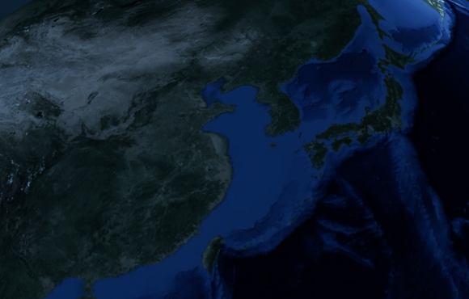
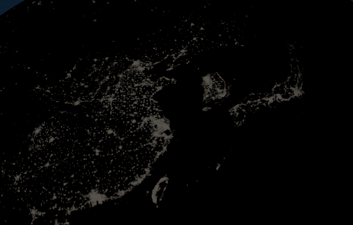
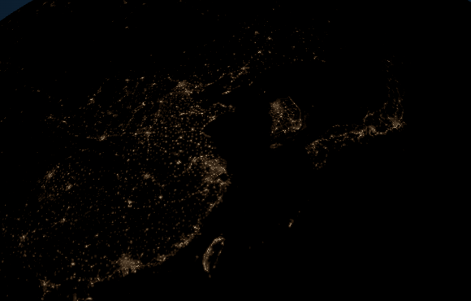
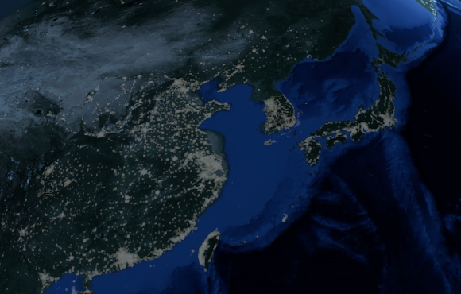
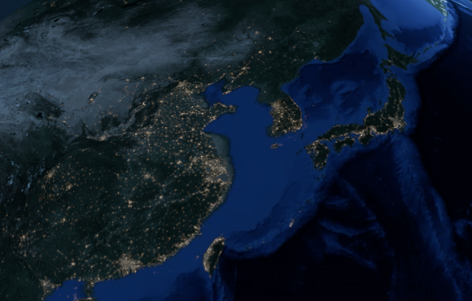
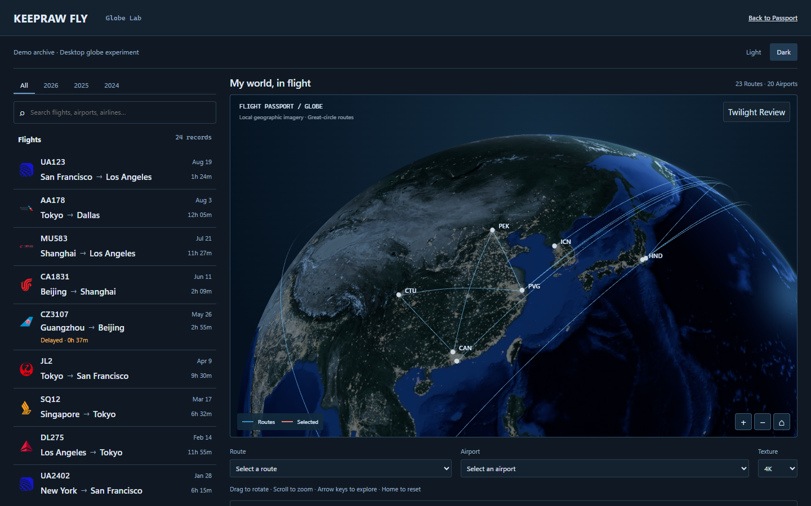
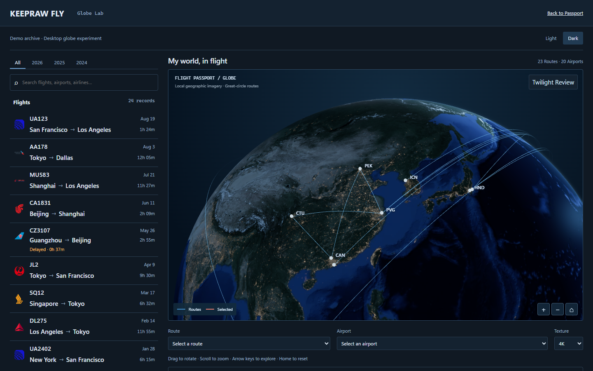

# Task 1B-6 Dark city-light appearance review

**Visual approval pending. Keep Draft PR #34 and await the owner's visual review.**

This change makes Dark city emission read differently from illuminated terrain. It reuses the unchanged NASA 2K/4K data, preserves the B5 scalar response for quiet urban fabric, and adds local source-driven tonal structure and a narrow glow footprint. Light rendering and city-disabled Dark surface are pixel-identical to B5.

[Actual display diagnostics](display-diagnostics.json) · [Scene settings and PNG hashes](manifest.json) · [Checks and limitations](test-results.json) · [Production isolation](production-isolation.json) · [Task 1B-5](../task-1b-5/README.md)

## Diagnosis and implementation

The original design board's Desktop Dark panel was reopened alongside B5's real browser images. The concept separates warm luminous accents from cool-blue terrain, with quieter light between them. B5 instead displayed broad near-neutral patches that resembled reflectance. Its Surface Only view did not contain those patches; its Emission Only view already looked gray and flat. Thus the main cause was emission appearance, not lights hidden solely by the surface.

The existing scalar shoulder gave city cores and surroundings similar output levels, while the near-neutral palette stayed low in the ACES display range. Bilinear sampling/downsampling spreads bright source neighborhoods into plateaus. A temporary browser-only diagnostic used the checksum-verified native NASA JPEG: finer granularity alone did not resolve broad plateaus and the emission/material distinction. No additional texture was shipped.

The new Dark-only kernel samples the same map at the center and four neighbors one source texel away. Local positive contrast distinguishes compact real peaks from broad neighborhoods. Quiet warm fabric uses the unchanged B5 response; source-ranked, locally prominent cores supply warmer white accents; a small high-signal neighbor term supplies soft spill within the same local footprint. Every component derives from actual registered data. The background floor remains 0.012. Colors and tonal budgets differ by component, instead of multiplying all previous light values. The contribution remains linear before the existing shared solar mask, ACES and sRGB output.

The shader costs four additional local texture fetches in Dark, with no extra pass, dependency, map, framebuffer or random light point. The renderer adds only the resolution-specific texel-size uniform. Surface material, sun, terminator, atmosphere, camera, route geometry/data and the official Passport remain unchanged. No unrelated refactor or performance matrix was undertaken.

## Three actual rendering layers

All images are unedited Chrome 154.0.8037.58 / WebGL 2 / Intel UHD / ANGLE D3D11 output. The same 1440×900, DPR1, 4K Demo/Home composition retains 24 flights, 23 directed routes, 22 physical strokes, 20 airports, art A, exposure1 and no selection. Camera, FOV, ViewOffset, viewport, complete route metadata and all normal lighting settings match B5. These 580×370 browser clips use x650/y310, without zoom or rescaling. Five new PNGs total 1,369,822 bytes; B5 Combined and full-route images are referenced directly.

**Surface Only** — city emission and atmosphere disabled. This frame is pixel-identical to the same B5 layer; geography and material have not been darkened to disguise the lighting issue.

**Emission Only** — surface, atmosphere and aviation overlays disabled. This is the actual final emitted-light shader output through ACES/sRGB, not a raw grayscale map or a fabricated light visualization.

| B5 Emission Only                    | B6 Emission Only                   |
| ----------------------------------- | ---------------------------------- |
|  |  |

**Combined** — normal surface, city emission and atmosphere, with aviation overlays hidden for inspection.

| B5 Combined                                      | B6 Combined, identical camera and data |
| ------------------------------------------------ | -------------------------------------- |
|  |      |

The regenerated B5 Combined clip exactly matches its archived SHA-256. Normal Light Earth-only rendering also matches B5 pixel-for-pixel. Full scene/screenshot provenance is in manifest.json.

| B5 full route network                      | B6 full route network          |
| ------------------------------------------ | ------------------------------ |
|  |  |

Visual inspection shows quieter intercity fabric, small warm-white accents and softer local transitions in eastern China, Beijing/Tianjin, the Yangtze and Pearl deltas, Korea and Japan. Cities now differ in color and local contrast from gray-blue mountain/plateau detail. Routes retain their cool-blue hierarchy. The camera's geography and B4's stronger bathymetric contrast remain; the reference's clouds, photographic depth and Europe-to-Asia composition are not reproduced. These observations support owner review; they do not establish visual approval.

## Display evidence and tests

Emission metrics use 377,790 non-grazing sphere samples, independently reconstructed from perspective rays including ViewOffset. Actual HTML control rectangles are excluded; early unmasked exploratory metrics included controls/background and were discarded. The screenshots themselves are unchanged. Weighted luminance uses displayed sRGB values 0–255, not physical radiance.

| Emission-only measurement        |     B5 |                          B6 |
| -------------------------------- | -----: | --------------------------: |
| Sphere mean luminance            |  3.317 |                       1.696 |
| Visible-light median luminance   | 37.136 |                      16.264 |
| Visible-light p95 / median       |  2.083 |                       3.963 |
| Maximum light luminance          | 83.132 |                     163.741 |
| Median warm separation `(R-B)/R` |  0.171 |                       0.741 |
| Compact accent pixels, R >120    |      0 | 318 (1.07% of light pixels) |
| Near-white / clipped pixels      |  0 / 0 |                       0 / 0 |

The mean is lower, while a small subset gains stronger contrast: overall brightness or density is not the solution. City visibility coverage remains close to B5 (Beijing/Tianjin65.30→64.49%, Yangtze71.24→70.35%, Pearl52.88→51.98%). Tibet and the offshore Pacific retain zero city-changed pixels. Normal route/airport overlay median absolute contrast is47.03, above the largest metropolitan periphery mean18.69. This metric includes markers/labels and does not prove every individual arc dominates every luminous core. 2K is verified without another PNG batch.

- **307 unit tests passed** (core66, validator31, web207, CSS AST3); B5 curve/texture tests remain unchanged. Typecheck, production build, formatting, documentation consistency, CSS lint/tokens and diff checks passed. Build retains its existing >500 kB warning.
- Focused Chromium first run: **14 passed / 1 failed**. All12 Globe/solar/night checks passed, including actual2K/4K emission color/contrast, no clipping, dark controls, shared solar regions, world sun, interactions, loading/fallback and idle behavior. Official Passport Dark and geographic interaction passed; Light's `heightFits` assertion failed. The unchanged complete B5 snapshot then passed that Light test1/1; the current branch's sequential follow-up also passed1/1. Cause remains undetermined. No official source, assertion, timeout, retry or CI was changed.
- B5's night pixel test initially failed its requirement that every periphery become brighter than B4. B6 explicitly supersedes that artistic objective: geography/background/core-versus-periphery/route assertions remain, and a new real-output test compares warm separation, tonal hierarchy, restrained mean and sparse bright accents with actual B5 emission. The new test passed at both resolutions. The change is documented rather than presented as an unchanged B5 brightness acceptance.
- Nine official bundled production assets retain identical names, sizes and SHA-256 against B5. No new production cost or formal Passport integration.
- Prior B5 [CI38013258594](https://github.com/keepraw/Keepraw-Fly/actions/runs/38013258594) is complete: Chromium110 passed / one existing motion-camera assertion failed; the B5 night-response test passed. WebKit succeeded, Firefox failed, deploy skipped. No remote camera/Firefox fix is claimed. New-head CI is recorded on PR #34; no additional local Firefox/WebKit matrix was run.

**The focused refinement is submitted and further visual changes stop here. Visual approval pending.**
