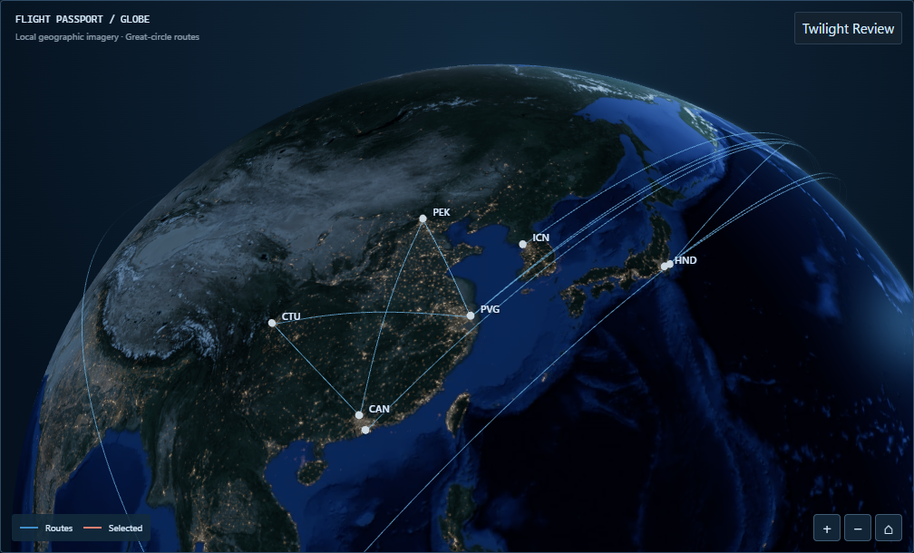
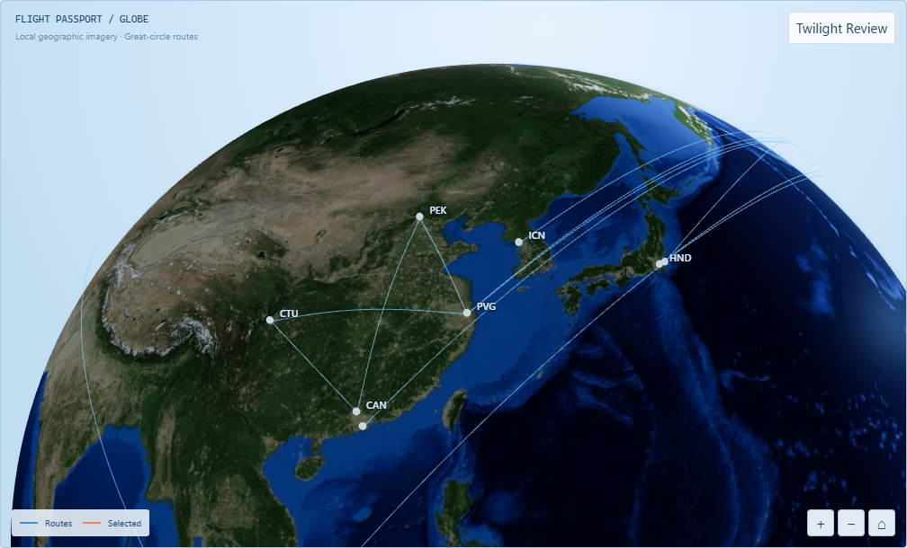
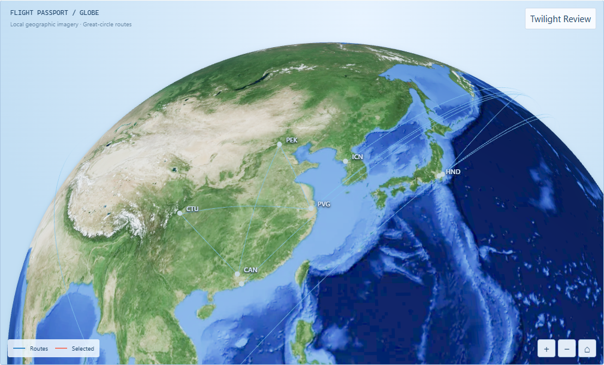
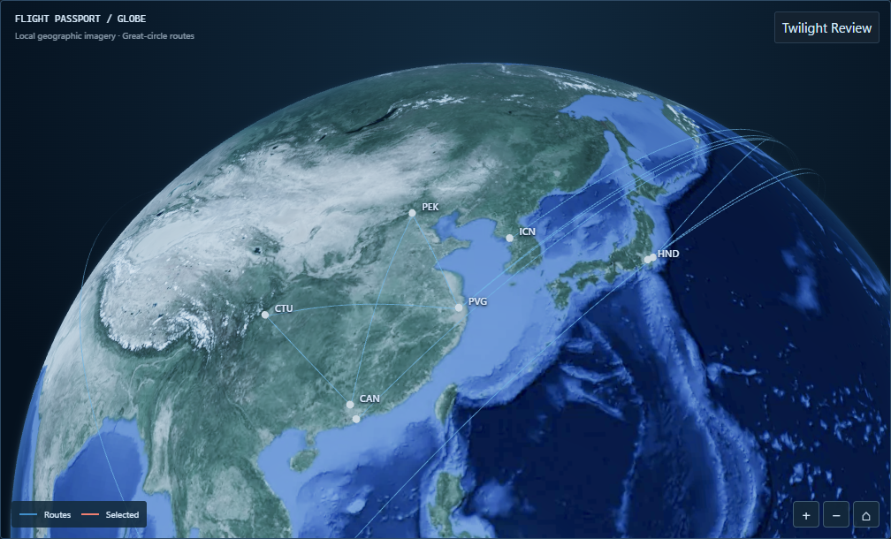

# Task 1B-7A — Fixed / Real-time Solar Lighting

**Isolated experiment. Do not merge PR #34 directly. Stop after 7A; no photographic/material redesign.**

Branch: `codex/globe-solar-7a` · Baseline: `6df4ae08cc29c6217148bd40d7459cc8ce2ca651`

## What changed (solar system only)

- New `apps/web/src/globe/globe-solar.ts`: `FIXED_SUN_DIRECTION` (historical Demo vector), `solarSubpointFromUtc()` / `solarDirectionFromUtc()` (axial tilt + seasonal declination + daily rotation via low-precision NOAA/Meeus: mean longitude/anomaly, ecliptic longitude, obliquity, RA, GMST; subsolar lon = RA − GMST), `msUntilNextUtcMinute()`. UTC instant via `getTime()`, so local timezone cannot affect it. No custom-time controls, no external services.
- `globe-renderer.ts`: sun decoupled from `home.direction`/camera data. Uniform defaults to `FIXED_SUN_DIRECTION`. New controller `solar(direction)` updates the shared `sunDirection` uniform + single on-demand frame. No scene rebuild, texture reload, camera reset. `lighting()`/`theme()` never touch the sun.
- `GlobeMap.tsx`: new `solarMode` prop (`data-solar-mode` on stage). Creation deps still `[routes, quality, retry]` — solar never recreates the renderer. Mode switch calls `solar()` once. Real-time minute timer aligns to next UTC minute boundary (+50 ms), plus `visibilitychange` resync. Timer exists only in Real-time; cleared on mode change/unmount. Each tick is one on-demand frame, not a loop.
- `GlobeLab.tsx` + `lab-locales.ts` + `globe-lab.css`: compact accessible `Solar Mode: Fixed / Real-time` radio group in Lighting Review. Fixed default. Reset lighting also resets to Fixed (baseline restore).
- Surface materials, night-emission shaders, camera composition, atmosphere, routes, Passport untouched.

## Screenshots (same camera/viewport/data)

Viewport 1440×900, Demo all-years default filter, Home camera unmoved. Full provenance in `manifest.json`.

| Fixed Dark                    | Fixed Light                     |
| ----------------------------- | ------------------------------- |
|  |  |

| Real-time Light                        | Real-time Dark                       |
| -------------------------------------- | ------------------------------------ |
|  |  |

Captured 2026-10-10T03:43:08–11Z:

- Fixed both: `[-0.2926889023874383, 0.290121517531001, 0.9111326530669097]` (Asia night; Dark shows cities, Light lifts terrain — baseline preserved).
- Real-time both: `[-0.5112588387024527, -0.11531980958902485, -0.8516547078276328]` (subsolar ~6.6°S 121°E, Asia day; no cities in day hemisphere, Light/Dark differ only in grading).
- Camera identical all four: `[-1.1462179214868498, 0.5012782172755569, -1.6866845067609426]`, 22 physical routes.

## Verification

- Unit: `globe-solar.test.ts` 9 passed (fixed constant/unit/determinism; equinox lat≈0±0.6° lon±3°; solstices ±23.44°; 12h rotation ≈180°; UTC-absolute; sphere roundtrip; theme-shared `solarRegion`; minute-boundary delays). Web suite 216 passed. Typecheck clean.
- Playwright (system Chrome, `PLAYWRIGHT_EXECUTABLE_PATH`): new `e2e/globe-solar-mode.pw.ts` 4/4 passed — fixed stability across filter/camera/themes; realtime UTC equinox/solstice + theme sharing (mocked clock); mode switch preserves canvas element/camera/selection; minute updates idle-stable (no continuous frames). Existing `globe-solar`, `globe-lighting`, `globe-scene`, `globe-lab` (5), `globe-art`, `globe-night-style`, `globe-night-response` all passed on Chromium. No assertions weakened; SVG fallback branches retained.
- Capture script: `scripts/capture-task-1b-7a.mjs` (4 stage shots only, no batch).

## Known limitations

- Playwright browsers could not be downloaded in this sandbox (CDN timeout); runs used system Chrome via `PLAYWRIGHT_EXECUTABLE_PATH`. Firefox/WebKit matrix not rerun.
- Real-time capture instant is wall-clock dependent by design; reproducibility comes from recorded UTC + deterministic unit cases, not identical pixels.
- Minute timer does not retroactively fire while hidden; it resyncs on `visibilitychange` instead (avoids background work).
