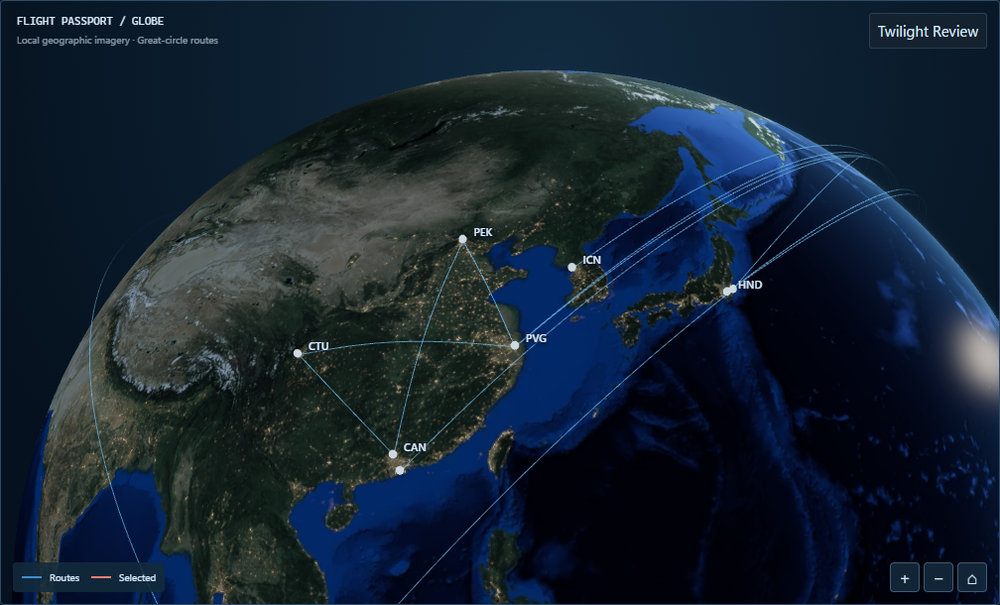
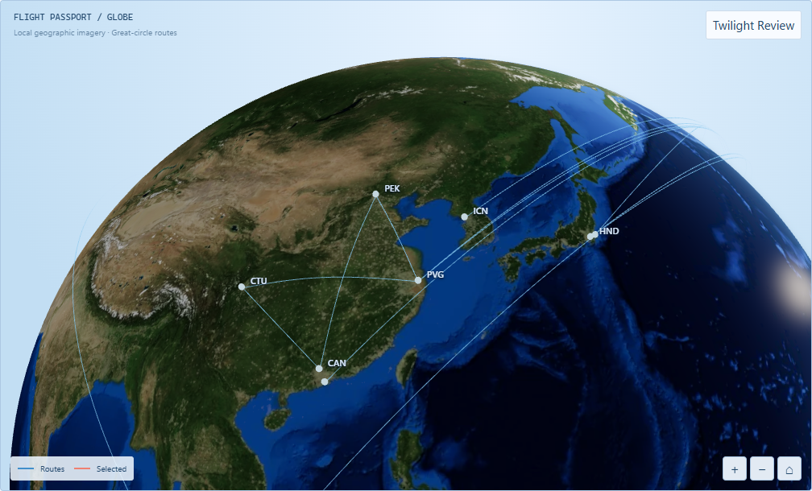
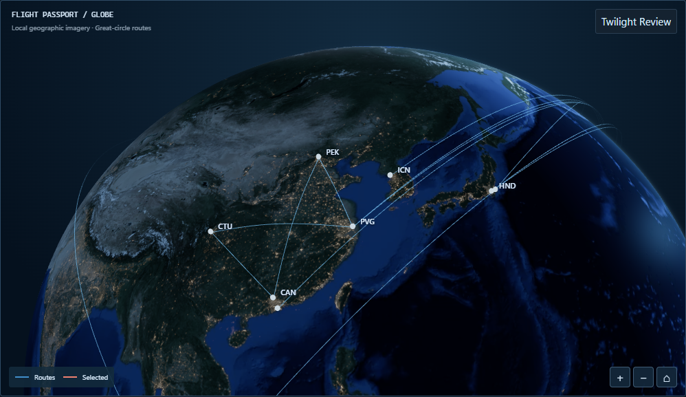
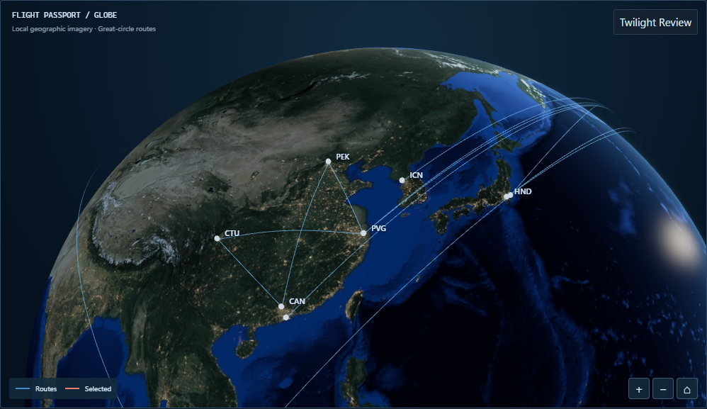
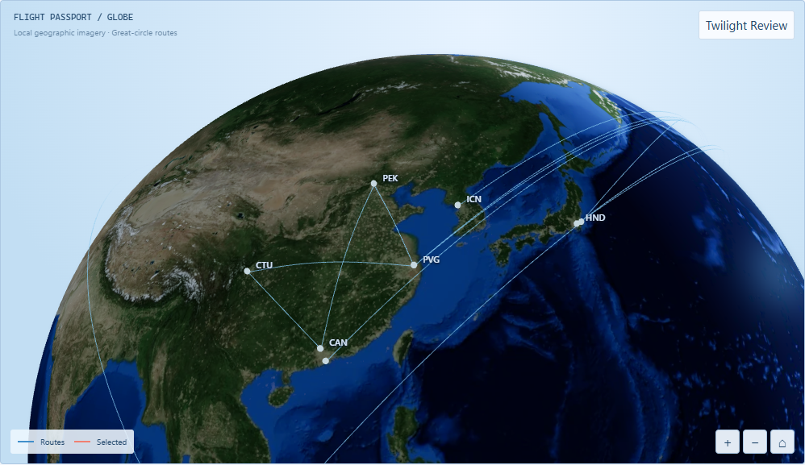
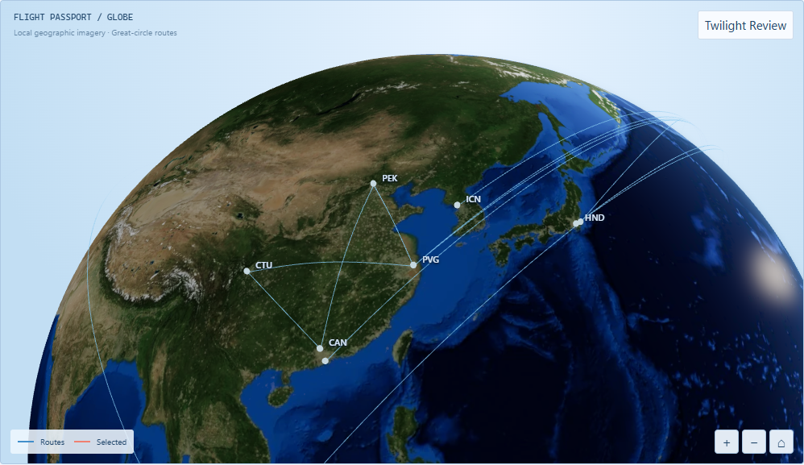
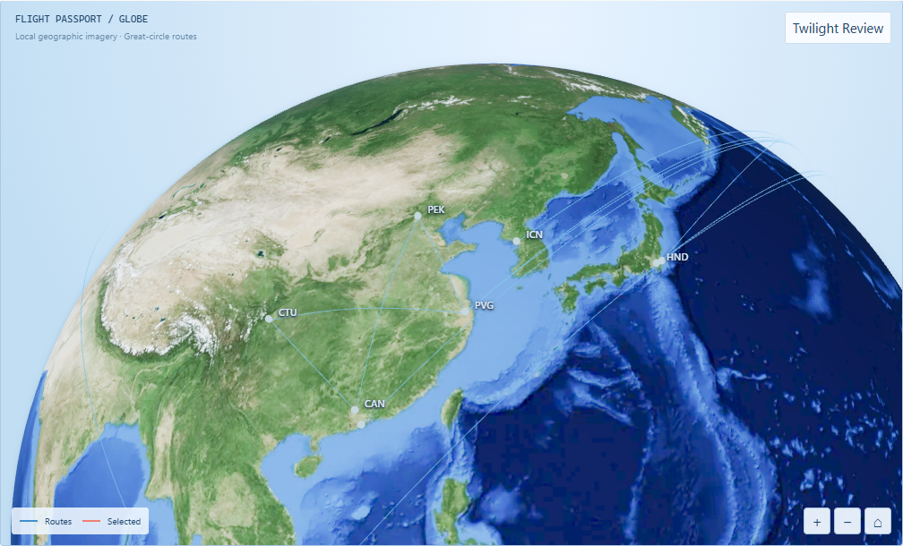
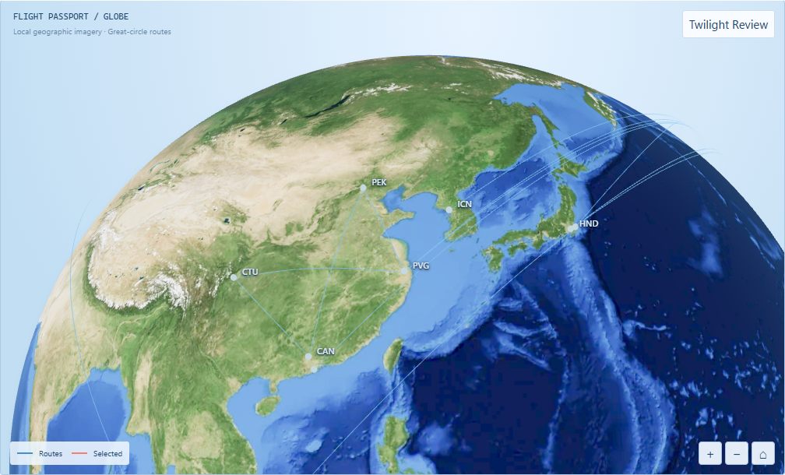
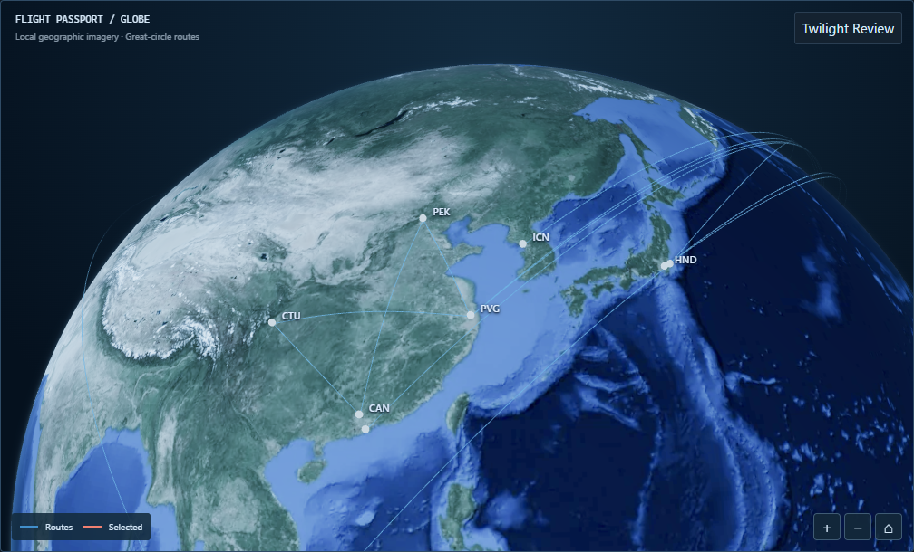
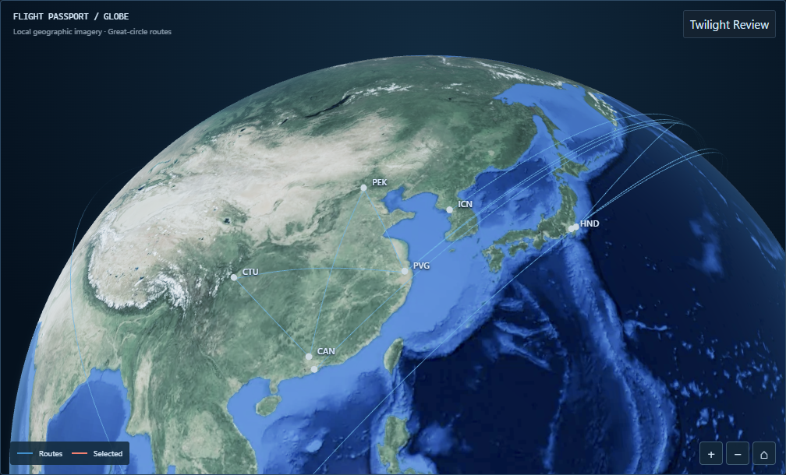

# Task 1B-7B — Cinematic Globe Visual Reconstruction (first pass)

**Visual approval pending. Isolated experiment on `codex/globe-cinematic-7b` from `fec2798a432a8a3b69326d7737c9f7ee02412726`. Do not modify PR #34, the official Desktop Passport, statistics, or merge anything.**

Reference: original KEEPRAW FLY board, Desktop Dark 01 and Desktop Light 04. Baseline: Task 1B-4 through 1B-6 captures plus Task 1B-7A Fixed/Real-time solar system.

## What changed (architecture, not global RGB)

Only `apps/web/src/globe/globe-lighting.ts` surface/atmosphere shaders. No camera, sun, city-kernel, texture, route, interaction, fallback, or Passport changes.

- **Shared solar illumination:** `solarResponse` kernel, `FIXED_SUN_DIRECTION`, `twilightWidth`, `sunIntensity=2.2`, exposure 1 unchanged. Both themes and A/B share the same geographic energy/terminator.
- **Indirect lighting:** flat `.32` fill replaced by twilight-aware fill `mix(.36,.58,day)+.12*twilight*(1-.5*day)`. Lifts terminator readability where texture was muddy; deep night stays darker for city contrast.
- **Direct key:** exponent `.65→.72` for photographic contrast; oceans keep `0.80×` direct vs land (material separation, not a mask that erases RGB).
- **Ocean response:** tiny uniform specular replaced by view-dependent fresnel sky sheen (`pow(1-NdotV,3)`, day-modulated, `vec3(.20,.42,.68)*.28`) plus sharp warm glint (`pow(NdotH,220)`, `vec3(1,.86,.66)*.38`). Luminous Light oceans without uniform cobalt heaviness.
- **Theme grading:** global desat/multipliers replaced by luminance-dependent desat (`Light .30→.12`, `Dark .68→.38`) plus land/ocean balances. Dark land red lifted (`.42→.58`) for readable warm terrain; oceans stay navy. Light land near-neutral, oceans controlled blue (`1.22→1.14` ocean, `1.06` land).
- **Surface rim:** `pow 7→6`, night halo removed (backlit falls away), day blue `vec3(.055,.15,.30)` plus warm twilight `vec3(.20,.16,.11)` gated by `horizonTwilight`. Peaks at `solar=0`, never midday.
- **Shell:** night alpha `0.025→0.0` (no uniform halo), forward lobe `0.35+0.95*pow(max(mu,0),3)` toward sun azimuth, `pow(day,1.25)` concentration, warm twilight shoulder. Same `.0032` core/`.0065` skirt geometry.
- **Preserved:** `cityLightResponse` and `darkCityEmission` kernels byte-identical; NASA Blue/Black Marble UVs; 22 physical routes, great-circle heights, limb fade, picking, orbit/zoom/Home, WebGL fallback, Passport SVG isolation.
- **Not added:** clouds, bloom, fabricated lights, postprocessing, composition changes. Camera frozen to distinguish material from composition.

## Controlled capture

Viewport 1440×900, DPR 1, 4K, Demo all-years, Home unmoved between theme/mode shots. Script `scripts/capture-task-1b-7b.mjs` (system Chrome). No console/page errors, no external requests.

- Fixed sun identical before/after: `[-0.2926889023874383,0.290121517531001,0.9111326530669097]`.
- Camera identical all six pairs: `[-1.1462179214868498,0.5012782172755569,-1.6866845067609426]`, FOV 34, 22 routes, exposure 1, `2.2/0.18/0.65/1` lighting, art A.
- Realtime theme-shared within each prefix (Light/Dark same sun); wall-clock differs ~33 s between before/after by design.
- Passport allocation remeasured live: outer `998×576.0625`, client `996×574`; Lab stage resized, Home recomputed for that aspect, Light/Dark share the passport Home.
- `before-fixed-dark` bytes 615184 and `before-fixed-light` 655243 match Task 1B-7A archives exactly.

| Fixed Dark before                           | Fixed Dark after                          |
| ------------------------------------------- | ----------------------------------------- |
|  |  |

| Fixed Light before                            | Fixed Light after                           |
| --------------------------------------------- | ------------------------------------------- |
|  |  |

| Passport Dark before                              | Passport Dark after                             |
| ------------------------------------------------- | ----------------------------------------------- |
|  |  |

| Passport Light before                               | Passport Light after                              |
| --------------------------------------------------- | ------------------------------------------------- |
|  |  |

| Realtime Light before                               | Realtime Light after                              |
| --------------------------------------------------- | ------------------------------------------------- |
|  |  |

| Realtime Dark before                              | Realtime Dark after                             |
| ------------------------------------------------- | ----------------------------------------------- |
|  |  |

Manifests: `before-manifest.json`, `after-manifest.json`. Pixels: `pixel-comparison.json` (real browser canvas, not mockups).

## Pixel evidence (stage means, 0–255 sRGB)

| Pair           | Changed | Luminance                 | Blue excess `B-max(R,G)` |
| -------------- | ------- | ------------------------- | ------------------------ |
| Fixed Dark     | 57.01%  | 28.56→33.19 (+4.62, +16%) | 16.91→14.60 (−2.32)      |
| Fixed Light    | 54.45%  | 94.29→98.10 (+3.82, +4%)  | 14.28→11.70 (−2.58)      |
| Passport Dark  | 55.22%  | 28.49→33.08 (+4.59)       | 17.02→14.79 (−2.23)      |
| Passport Light | 52.80%  | 98.77→102.59 (+3.83)      | 14.74→12.22 (−2.52)      |
| Realtime Dark  | 70.60%  | 76.34→81.01 (+4.67)       | 29.81→23.88 (−5.93)      |
| Realtime Light | 70.56%  | 149.84→151.46 (+1.62)     | 19.79→15.71 (−4.08)      |

Dark gains readable terrain without washing night; Light gains modest luminosity with −18% blue excess (cleaner, not washed); passport-size mirrors Lab; realtime shares geography across themes.

## Verification

See `test-results.json`, `production-isolation.json`.

- `pnpm test`: 316 passed (web 216, core 66, validator 31, CSS 3). Typecheck, build, docs, CSS lint/tokens, `git diff --check` pass.
- Chromium (system Chrome, 1 worker): solar-mode 4/5 then 1/1 retry (hidden-timer flake, no product change), solar 1/1, lighting 2/2, art 1/1, night-response 1/1, night-style 1/1, scene 1/1, lab 5/5, passport-desktop 3/3. No assertions weakened.
- Production: 9/9 asset names/bytes/SHA-256 identical to Task 1B-6 (0 differences); Globe Lab DEV-only.

## Honest limits

Dark terrain is more legible with retained warm cores/routes, but night remains night — not a daytime conversion. Light oceans are cleaner and less cobalt, but still map-like next to 04's photographic softness; snow/desert separation improved, not perfect. Atmosphere is concentrated toward the sun with no night halo, but the shell edge can still read at grazing angles. No clouds or depth-of-field; composition frozen (Asia Home, true long-haul geometry). Realtime reproducibility is via recorded UTC plus unit cases, not identical pixels. Await owner approval before any second layer or composition proposal.
