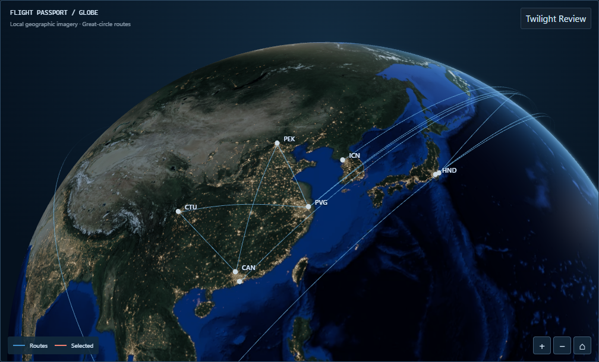

# Task 1B — Approved Control and canonical Globe evidence

The owner approved **Control** as the immutable Globe baseline for subsequent development. This is a historical Task 1B record: the Owner subsequently accepted Task 2C and Task 3, and PRs #34 and #35 were merged. The official Desktop Passport now uses the approved production 3D Globe (with SVG fallback). No frozen Control image, camera or lighting setting is changed by this documentation update.

## Canonical references

All six PNGs remain byte-identical to checkpoint `8e759707c1c265b360183160f6fe369428e30b4a`. [Canonical manifest](canonical-manifest.json) preserves original scene, lighting, camera, dimensions, bytes and SHA-256.

| Reference                                                           | Purpose                                        |
| ------------------------------------------------------------------- | ---------------------------------------------- |
| [Approved Dark Control](comp-control-fixed-dark.png)                | Authoritative owner-approved visual            |
| [Light Control](comp-control-fixed-light.png)                       | Theme counterpart                              |
| [Passport allocation, Dark](comp-control-passport-dark.png)         | Future integration size reference              |
| [Selected SFO → HKG](comp-control-selected-SFO-HKG-dark.png)        | Long-haul selection hierarchy                  |
| [Post-specular Passport, Light](specular-fixed-passport-light.png)  | Light regression at actual Passport allocation |
| [Post-specular PEK → PVG](specular-fixed-selected-PEK-PVG-dark.png) | Short-haul selected route regression           |

## Frozen technical decisions

- Approved lighting: sun intensity **0.7**, twilight width **0.18**, atmosphere **2.0**, night **2.0**, exposure **1**, art direction A. Fixed world sun `[-0.2926889023874383, 0.290121517531001, 0.9111326530669097]`.
- Control Home: direction `[-0.5458180578508808, 0.23870391298836036, -0.803183098457592]`, distance **2.1**, offset `(-0.0459629031778328, -0.5004980895646883)` in the recorded Lab allocation. Home/compose algorithms remain data-dependent and frozen for Task 2.
- Approved ocean specular refinement: `pow(NdotH, 60.0) * 0.16`, gated by facing and `0.25 + 0.75 * diffuse`. Historical pre-refinement response was `pow(NdotH, 220) * 0.38`. No further surface/atmosphere/city kernel changes.
- Recorded Demo: 24 flights, 23 directed routes, 22 physical strokes, 20 airports. Passport outer map allocation at the checkpoint: **998 × 576.0625**, client **996 × 574**. These are historical measurements, not Task 2 dimensions.
- Real-time solar mode uses actual UTC and the existing minute/visibility cadence. Fixed mode restores the canonical direction. No clouds, Bloom, post-processing or production WebGL integration.

## Cleanup and provenance

[Before/after inventory](cleanup-inventory.json) lists every removed and retained PNG with its original size and hash: **124 → 6 files**, **118 removed**, **68,539,317 bytes** removed from the current checkout/tree. Git history and its object storage remain intact; no rewrite or force-push.

The two extra post-specular references above cover concrete Light/allocation and short-route regressions. No additional historical PNG exceptions were necessary. Production textures, concept assets, tests, numerical measurements, shader diagnostics, licensing metadata and the transfer-curve SVG remain.

Earlier checkpoint READMEs and JSON reports retain their numerical results and source provenance. Removed embeds are explicitly marked historical; JSON `screenshotLifecycle` makes former filenames audit identifiers rather than live links. Original scene records, pixel results and hashes are unchanged. Recover an old PNG from the inventory's baseline commit when an audit requires it.

Historical B/C camera experiments and before/after capture manifests remain as provenance only. B/C were rejected in favor of Control and are not implementation recommendations. Earlier approval-pending statements refer only to those historical checkpoints. Previous capture scripts describe historical experiments; do not rerun camera exploration for Task 2.

## Historical verification

The checkpoint recorded passing workspace typecheck/build and 216 web + 66 core + 31 validator tests (plus CSS-token tests). Focused system-Chrome Globe verification recorded 12/12 passes after the documented solar/night threshold recalibration. Deterministic UTC tests use June/December 2026 clocks and wait for rendered lighting before sampling. These results are retained as historical facts, not claimed as Task 2 validation.

Photographic cloud depth remained deferred at this historical checkpoint; the official Passport 3D integration was completed later in Task 3. See the [Task 3 screenshot index](../task-3/SCREENSHOTS.md) for the approved production evidence and [Task 4 cleanup](../CLEANUP-2026-10-10.md) for the retained screenshots.
