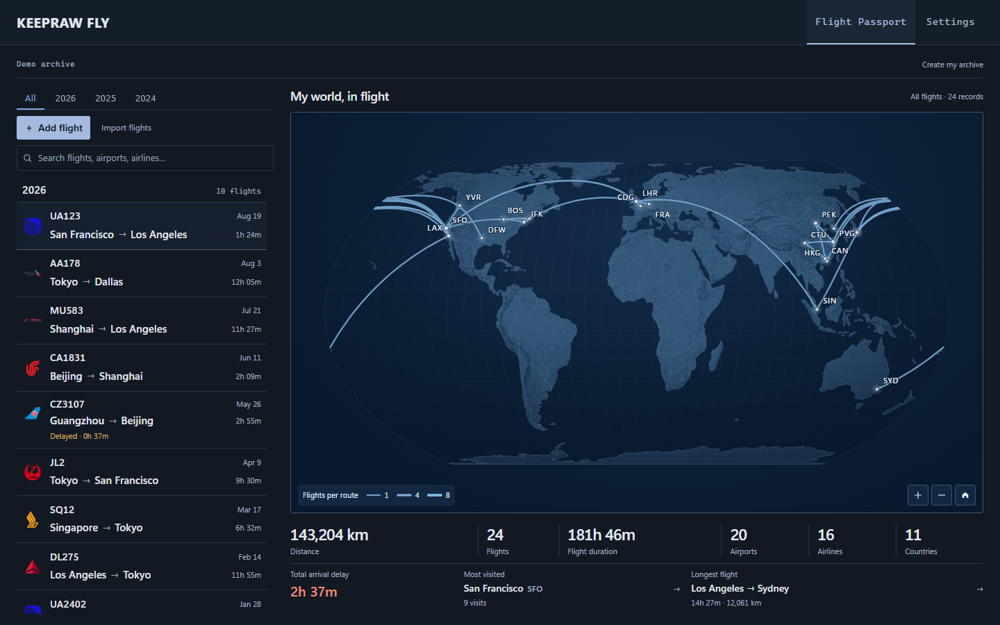
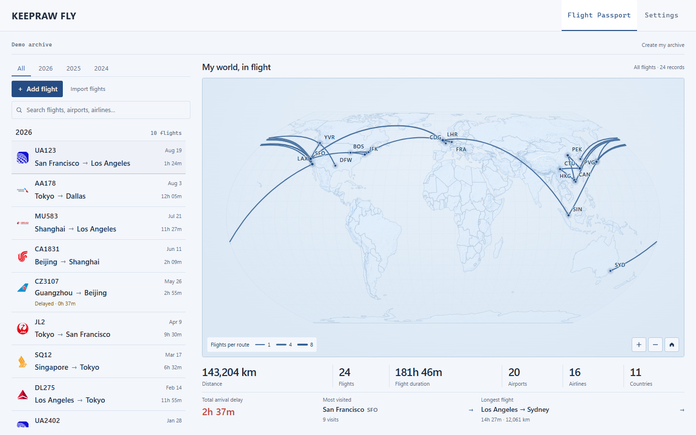

# Task 2 — Desktop Passport statistics and solar preference

PR #34 only, base `codex/desktop-passport-redesign-checkpoint`. Control is approved; Task 2 Desktop UI awaits owner visual review. PR stays Draft. Stop here before Task 3 / production WebGL integration.

## Desktop statistics and Highlights

Six existing KPIs form one compact region: Distance, Flights, Flight duration, Airports, Airlines, Countries/Regions. Existing calculations, units, locale formatting, cancellation/diversion semantics, search, annual/lifetime and archive behavior are reused unchanged.

The secondary row shows total arrival delay, the most visited city/IATA with visit frequency, and localized longest-flight cities with duration and selected-unit distance. Actual duration is used when both actual times exist; otherwise the established scheduled-duration helper applies. Unknown delay stays `—`, recorded zero stays formatted zero, and early arrivals never offset positive delay. The arrival-delay explanation remains available through title/accessibility description.

Airport/route buttons retain filtering, pressed state, keyboard operation and highlighting. The city name remains visible at narrower desktop widths. Typography uses tabular numbers and restrained shared separators. Mobile Passport and Flight Detail have no design changes; 760/761 is preserved; Highlights are hidden at desktop heights ≤540px.

## Unedited browser review

Repository Demo, Lifetime, English, kilometers, DPR1, reduced motion. Production Passport continues to use its established SVG map. No fabricated routes, miniature Highlight maps or screenshot compositing.

| Viewport   | Dark                               | Light                                |
| ---------- | ---------------------------------- | ------------------------------------ |
| 1440 × 900 | [Dark](passport-dark-1440x900.png) | [Light](passport-light-1440x900.png) |
| 1366 × 768 | [Dark](passport-dark-1366x768.png) | [Light](passport-light-1366x768.png) |
| 1280 × 720 | [Dark](passport-dark-1280x720.png) | [Light](passport-light-1280x720.png) |
| 1024 × 768 | [Dark](passport-dark-1024x768.png) | [Light](passport-light-1024x768.png) |
| 761 × 900  | [Dark](passport-dark-761x900.png)  | [Light](passport-light-761x900.png)  |

[Capture manifest](screenshots.json) records untouched PNG hashes, browser version, all six values, all three Highlights and actual geometry. No page/right-region overflow or clipped map controls occurred. At 1440 × 900, the map is **578.05px** high, KPI strip **64.95px**, Highlights **64px**; the checkpoint map was **576.06px**. At 761px, the same six KPIs use two compact rows. Archive scrolling remains independent.

Generate this exact ten-image set using `node scripts/capture-task-2.mjs` with the local development server running. It checks overflow and the approved Globe reference SHA-256 before/after capture.

## Globe evidence cleanup

[Canonical references](../task-1b-7b2/README.md) and [complete deletion/retention inventory](../task-1b-7b2/cleanup-inventory.json): 124 → 6 historical Globe PNGs, 118 deleted, **68,539,317 bytes** removed from the current tree. All six retained references are unchanged. Approved Dark Control SHA-256: `c17d906dc74bd44d91e80f247bc784f6d41e6a19e083778dc2a54d07e8bf24d5`.

Numerical evidence, original hashes/results, provenance, textures, tests, source concepts and licensing artifacts remain. Git history is intact.
